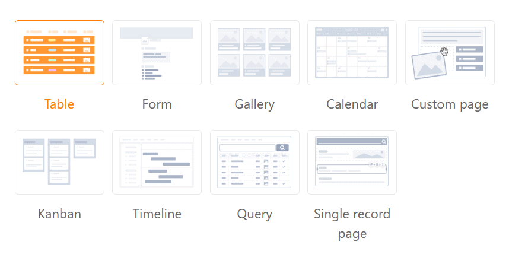
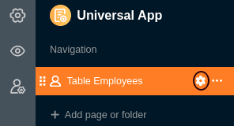
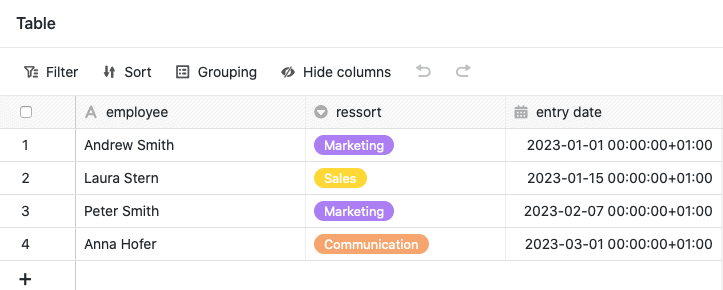
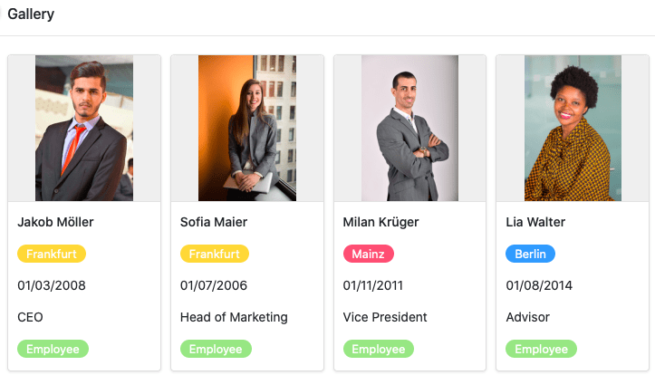
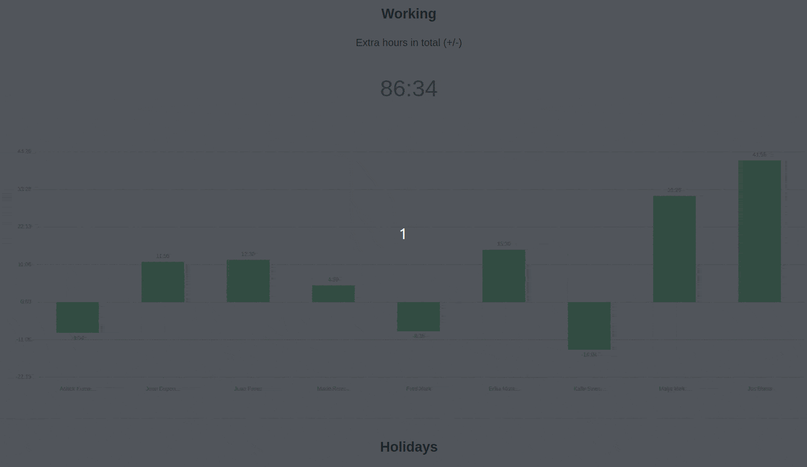
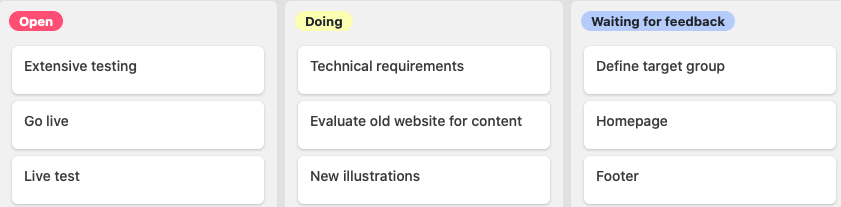
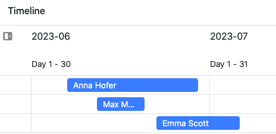
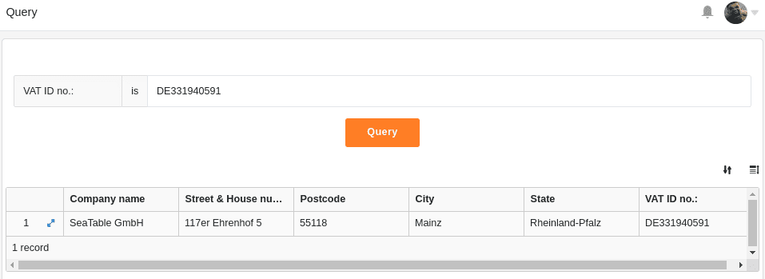
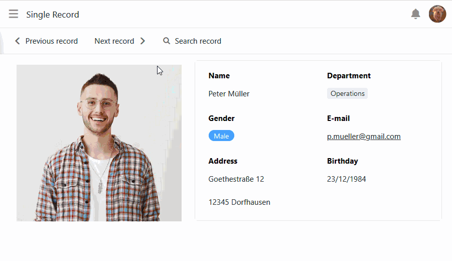

En el modo de edición de la **aplicación universal**, puede elegir entre varios **tipos de página** para diseñar su aplicación. Ya conoce la mayoría de los tipos de página de forma similar de otros lugares en SeaTable.

En este artículo general, aprenderá sobre los tipos de página disponibles y sus diferentes usos.

## Tipos de página en la aplicación universal

Actualmente puede elegir entre un total de **nueve tipos de página** en el modo de edición de la aplicación universal.

[Aprenda a crear nuevas páginas en la Universal App aquí.]()

Para editar las páginas existentes, haga clic en el **símbolo de la rueda dentada**  de la página correspondiente en la navegación.

## Tipo de página: Tabla

Puedes utilizar este tipo de página para añadir cualquier **tabla** de tu base como página a tu aplicación universal. Puedes utilizar las [autorizaciones de página]() para controlar exactamente quién puede ver y editar los datos de esta página. También puedes definir **filtros preestablecidos**, **clasificaciones**, **agrupaciones** y **columnas ocultas y de sólo** lectura para adaptar, limitar y organizar los datos mostrados con precisión a un grupo de usuarios.

[Más información sobre páginas de tablas en aplicaciones universales.]()

## Tipo de página: Formulario

Puedes utilizar este tipo de página para crear diferentes **formularios** que los usuarios pueden enviar. Los formularios [web]() no sólo están disponibles en la aplicación universal, sino también como una función independiente. Las páginas de formularios en la aplicación universal son ideales para recopilar **datos de muchos usuarios diferentes**. Un posible caso de uso es el [registro de las horas de trabajo de sus empleados](https://seatable.io/es/arbeitszeiterfassung/).

[Más información sobre páginas de formularios en aplicaciones universales.](https://seatable.io/es/docs/seitentypen-in-universellen-apps/formularseiten-in-universellen-apps/)

## Tipo de página: Galería

Con la ayuda de este tipo de página, puede mostrar **imágenes** que haya guardado en una [columna de imágenes de]() su tabla en forma de **galería**. También puede mostrar otros **datos** de su tabla en la galería. Por ejemplo, puede utilizar una página de galería para los **perfiles** claros **de sus empleados**.

  
[Más información sobre las páginas de la galería en las aplicaciones universales.](https://seatable.io/es/docs/seitentypen-in-universellen-apps/galerieseiten-in-universellen-apps/)

## Tipo de página: Calendario

Este tipo de página funciona de forma similar al [plugin de calendario](https://seatable.io/es/docs/plugins/anleitung-zum-kalender-plugin/) y le permite mostrar las entradas de una o dos [columnas de fecha de](https://seatable.io/es/docs/datum-dauer-und-personen/die-datum-spalte/) su tabla en un **calendario**. Un caso de uso concreto podría ser, por ejemplo, la visualización en el calendario de las próximas **reuniones**.

[Más información sobre las páginas de calendario en las aplicaciones universales.](https://seatable.io/es/docs/seitentypen-in-universellen-apps/kalenderseiten-in-universellen-apps/)

## Tipo de página: Página individual

Con este tipo de página, puede dar rienda suelta a su creatividad y construir una **página individual** a su gusto. Añade **texto** e **imágenes** a tu página o utiliza [estadísticas](https://seatable.io/es/docs/plugins/anleitung-zum-statistik-plugin/) para crear **cuadros de mando** significativos con los datos de tu base.

[Más información sobre páginas individuales en aplicaciones universales.]()

## Tipo de página: Kanban

Este tipo de página funciona de forma similar al [plugin Kanban](https://seatable.io/es/docs/plugins/anleitung-zum-kanban-plugin/) y permite mostrar las entradas como fichas en un **tablero Kanban**. Para ello, especifique la columna por la que deben **agruparse** las entradas. Un caso de uso específico podría ser la **visualización de los flujos de trabajo y el progreso del proyecto**, por ejemplo.

[Más información sobre las páginas Kanban en Universal Apps.](https://seatable.io/es/docs/seitentypen-in-universellen-apps/kanbanseiten-in-universellen-apps/)

## Tipo de página: Timeline

Este tipo de página es muy similar al [plugin Timeline](https://seatable.io/es/docs/plugins/anleitung-zum-timeline-plugin/) y permite mostrar distintos intervalos de tiempo en forma de **línea temporal**. Un caso de uso concreto podría ser la **planificación de las vacaciones en una** empresa, por ejemplo.

[Más información sobre las páginas de cronología en las aplicaciones universales.](https://seatable.io/es/docs/seitentypen-in-universellen-apps/zeitstrahlseiten-in-universellen-apps/)

## Tipo de página: Consulta

Este tipo de página, que funciona de forma similar a la [aplicación Consulta de datos](), le permite buscar valores específicos en los registros de campos concretos. Este tipo de página resulta especialmente útil para **grandes conjuntos de datos**, como catálogos de productos o bibliotecas. Un caso de uso concreto podría ser la consulta de números de identificación, por ejemplo.

[Más información sobre páginas de consulta en aplicaciones universales.]()

## Tipo de página: Ficha individual

Este tipo de página permite diseñar una página con elementos estáticos, campos de tabla dinámicos, colores, marcos, etc. para presentar visualmente los datos almacenados en una fila. Este tipo de página es, por tanto, similar al [plugin](https://seatable.io/es/docs/seitendesign-plugin/anleitung-zum-seitendesign-plugin/) de diseño de páginas que ya conoces de Base.

Los usuarios de la aplicación pueden navegar, buscar o editar los registros de datos individuales en esta página. Por tanto, este tipo de página es adecuada para mostrar los datos de una base de datos de empleados como **perfiles personales**, por ejemplo.

[Más información sobre las páginas del tipo Conjunto de datos único en aplicaciones universales.](https://seatable.io/es/docs/seitentypen-in-universellen-apps/seiten-vom-typ-einzelner-datensatz-in-universellen-apps/)
