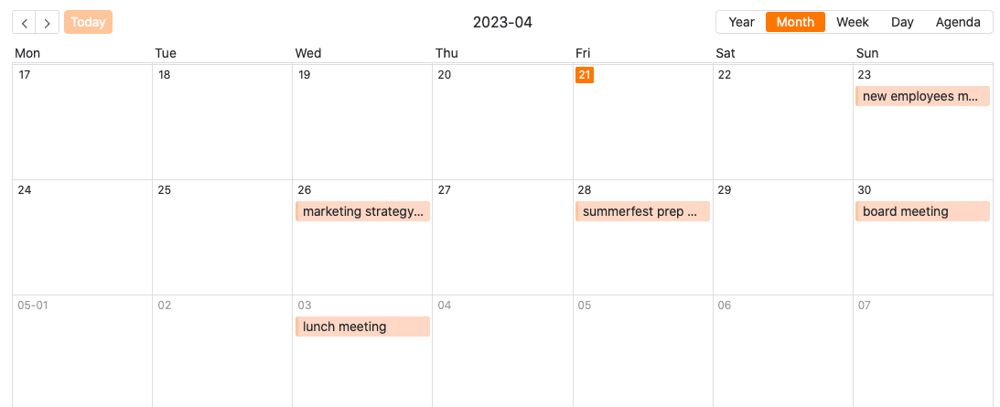

No modo de edição da aplicação **universal**, pode escolher entre vários **tipos de páginas** para conceber a sua aplicação. Já conhece a maioria dos tipos de página de forma semelhante noutros locais do SeaTable.

Neste artigo de síntese, ficará a conhecer os tipos de página disponíveis e as suas diferentes utilizações.

## Tipos de páginas na aplicação universal

Atualmente, é possível escolher entre um total de **nove tipos de páginas** no modo de edição da aplicação universal.

[Saiba como criar novas páginas na Aplicação Universal aqui.]()

Para editar páginas existentes, clique no **símbolo de roda dentada**  da página correspondente na navegação.

## Tipo de página: Tabela

Pode utilizar este tipo de página para adicionar qualquer **tabela** da sua base como uma página à sua aplicação universal. Pode utilizar as [autorizações de página]() para controlar exatamente quem pode ver e editar os dados nesta página. Também pode definir **filtros predefinidos**, **ordenação**, **agrupamentos** e **colunas ocultas e só de leitura** para personalizar, limitar e organizar os dados apresentados precisamente para um grupo de utilizadores.

[Saiba mais sobre páginas de tabela em aplicações universais.]()

## Tipo de página: Formulário

Pode utilizar este tipo de página para criar diferentes **formulários** que os utilizadores podem submeter. [Os formulários Web]() não estão apenas disponíveis na aplicação universal, mas também como uma funcionalidade separada. As páginas de formulário na aplicação universal são ideais para recolher **dados de muitos utilizadores diferentes**. Um caso de utilização possível é o [registo das horas de trabalho dos seus empregados]().

[Saiba mais sobre páginas de formulário em aplicações universais.]()

## Tipo de página: Galeria

Com a ajuda deste tipo de página, pode apresentar **as imagens** que guardou numa [coluna de imagens da]() sua tabela sob a forma de uma **galeria**. Também pode apresentar outros **dados** da sua tabela na galeria. Pode, por exemplo, utilizar uma página de galeria para apresentar **perfis** claros **dos seus empregados**.

  
[Saiba mais sobre as páginas da galeria em aplicações universais.]()

## Tipo de página: Calendário

Este tipo de página funciona de forma semelhante ao [plugin de calendário]() sua tabela num **calendário**. Um caso de utilização concreto poderia ser, por exemplo, a apresentação do calendário das próximas **reuniões**.

[Saiba mais sobre páginas de calendário em aplicações universais.]()

## Tipo de página: Página individual

Com este tipo de página, pode dar asas à sua criatividade e construir uma **página individual** de acordo com os seus desejos. Adicione **texto** e **imagens** à sua página ou utilize [estatísticas]() para criar **painéis de controlo** significativos com os dados da sua base.

[Saiba mais sobre páginas individuais em aplicações universais.]()

## Tipo de página: Kanban

Este tipo de página funciona de forma semelhante ao [plugin Kanban]() e permite-lhe apresentar entradas como cartões de índice num **quadro Kanban**. Para o efeito, especifique a coluna pela qual as entradas devem ser **agrupadas**. Um caso de utilização específico pode ser a **visualização de fluxos de trabalho e do progresso do projeto**, por exemplo.

[Saiba mais sobre as páginas Kanban nas Aplicações Universais.]()

## Tipo de página: Linha de tempo

Este tipo de página é muito semelhante ao [plug-in Timeline]() e permite-lhe apresentar diferentes períodos de tempo sob a forma de uma **linha de tempo**. Um caso de utilização concreto poderia ser o **planeamento de férias numa empresa**, por exemplo.

[Saiba mais sobre as páginas da linha do tempo em aplicações universais.]()

## Tipo de página: Consulta

Este tipo de página, que funciona de forma semelhante à [aplicação Data Query](), permite-lhe pesquisar os seus registos em campos específicos para valores específicos. O tipo de página é particularmente útil para **grandes conjuntos de dados**, como catálogos de produtos ou bibliotecas. Um caso de utilização concreto poderia ser a consulta de números de identificação, por exemplo.

[Saiba mais sobre páginas de consulta em aplicações universais.]()

## Tipo de página: Registo de dados único

Este tipo de página permite-lhe conceber uma página com elementos estáticos, campos de tabela dinâmicos, cores, molduras, etc., a fim de apresentar visualmente os dados armazenados numa linha. Este tipo de página é, portanto, semelhante ao [plugin de conceção de páginas]() que já conhece do Base.

Os utilizadores da aplicação podem navegar, pesquisar ou editar os registos de dados individuais nesta página. Este tipo de página é, por conseguinte, adequado para apresentar os dados de uma base de dados de empregados como **perfis pessoais**, por exemplo.

[Saiba mais sobre as páginas do tipo Conjunto de dados único em aplicações universais.]()
