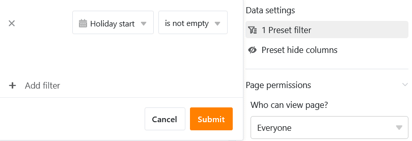
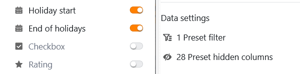

This page type is very similar to the [timeline plugin](https://seatable.io/en/docs/plugins/anleitung-zum-timeline-plugin/) and allows you to display different time spans in the form of a **timeline**. As this data view reveals overlapping dates, **vacation planning in a company**, for example, could be a specific use case.

## Page settings

If you want to change the settings of a page, click on the corresponding  **cogwheel symbol** in the navigation bar.

In the **page settings**, you can first set the graphic display of the timelines. To do this, select the [row color]() or a [single selection column](https://seatable.io/en/docs/auswahlspalten/anlegen-einer-einfachauswahl-spalte/), which determines the **color of the blocks**. You can also define a column for the **labeling of the blocks**.

To define the period of the entries, you need a [date column](https://seatable.io/en/docs/datum-dauer-und-personen/die-datum-spalte/) for the **start date**. For the **end date**, you can use another date column or another numerical column[(number](https://seatable.io/en/docs/text-und-zahlen/die-zahlen-spalte/), [duration](https://seatable.io/en/docs/datum-dauer-und-personen/die-dauer-spalte/) or [formula](https://seatable.io/en/docs/formeln/grundlagen-von-seatable-formeln/)) that specifies the number of days. You can also select the **time span**, i.e. how many years the timeline should cover.

## Preset filters and hidden columns

You can define **preset filters** and **hidden columns** to limit the data displayed for users. To do this, click on **Add filter**, select the desired **column** and **condition** and confirm with **Submit**.

Users can view more information about an entry by clicking on a block on the timeline. Therefore, decide which data should be **visible** and show or hide the corresponding columns using the **sliders**.



If you add a **grouping**, the bars can also be displayed in **swimlanes**. For non-overlapping activities, this view option results in a compact, clear display.

## Edit or move an entry on the timeline

You can easily edit entries by clicking on a **bar** and making the desired changes in the **line details** that open.

You can also **extend** or **shorten** the **time span** directly on the timeline. To do this, grab the right or left **edge of the bar** and drag it to the desired date.

You can also conveniently **move** entries on the timeline **using drag-and-drop**. SeaTable automatically adjusts the respective **date values**.

## Page authorizations

At the bottom of the page settings, you can restrict who can **see** the timeline page and **edit** entries. You cannot add or delete rows via timeline pages.

