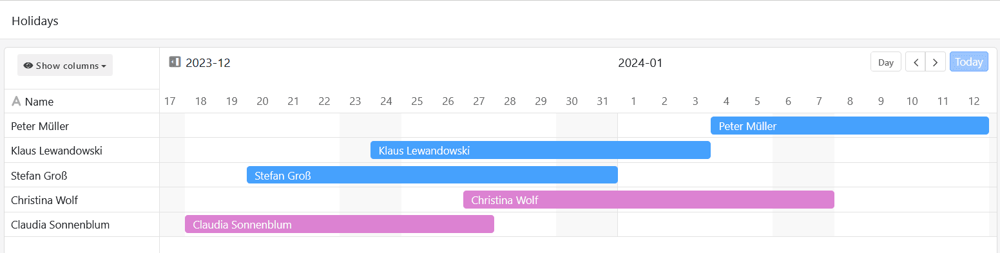
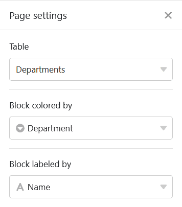
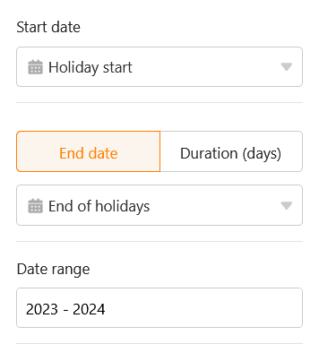
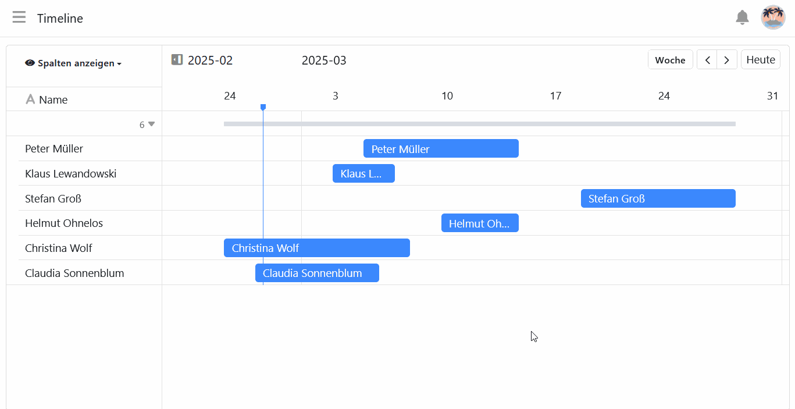

Este tipo de página es muy similar al [plugin de línea de tiempo](https://seatable.io/es/docs/plugins/anleitung-zum-timeline-plugin/) y le permite mostrar diferentes intervalos de tiempo en forma de **línea de tiempo**. Como esta vista de datos revela fechas que se solapan, la **planificación de las vacaciones en una empresa**, por ejemplo, podría ser un caso de uso específico.

## Configuración de página

Si desea cambiar la configuración de una página, haga clic en el **símbolo de rueda dentada**  correspondiente en la barra de navegación.

En la **configuración de la página**, puede establecer en primer lugar la representación gráfica de las líneas de tiempo. Para ello, seleccione el [color de la fila](https://seatable.io/es/docs/ansichtsoptionen/farbliche-markierung-von-zellen/) o de una columna [de selección](https://seatable.io/es/docs/auswahlspalten/anlegen-einer-einfachauswahl-spalte/), que determina el **color de los** bloques. También puede definir una columna para el **etiquetado de los** bloques.

Para definir el periodo de las entradas, necesita una [columna](https://seatable.io/es/docs/datum-dauer-und-personen/die-datum-spalte/) de fecha para la **fecha de inicio**. Para la **fecha final**, puede utilizar otra columna de fecha u otra columna numérica[(número](https://seatable.io/es/docs/text-und-zahlen/die-zahlen-spalte/), [duración](https://seatable.io/es/docs/datum-dauer-und-personen/die-dauer-spalte/) o [fórmula](https://seatable.io/es/docs/formeln/grundlagen-von-seatable-formeln/)) que especifique el número de días. También puede seleccionar el **lapso** de tiempo, es decir, cuántos años debe abarcar la línea de tiempo.

## Filtros preestablecidos y columnas ocultas

Puede definir **filtros preestablecidos** y **columnas ocultas** para limitar los datos que se muestran a los usuarios. Para ello, haga clic en **Añadir filtro**, seleccione la **columna** y la **condición** deseadas y confirme con **Enviar**.

Los usuarios pueden ver más información sobre una entrada haciendo clic en un bloque de la línea de tiempo. Por lo tanto, decida qué datos deben ser **visibles** y muestre u oculte las columnas correspondientes utilizando los **controles deslizantes**.



Si añade una **agrupación**, las barras también pueden visualizarse en **swimlanes**. En el caso de las actividades que no se solapan, esta opción de visualización da como resultado una visualización compacta y clara.

## Editar o mover una entrada en la línea de tiempo

Puede editar fácilmente las entradas haciendo clic en una **barra** y realizando los cambios deseados en los **detalles de la línea** que se abren.

También puede **ampliar** o **reducir** el **lapso de** tiempo directamente en la línea de tiempo. Para ello, agarra el **borde** derecho o izquierdo **de la barra** y arrástralo hasta la fecha deseada.

También puede **mover** cómodamente las entradas en la línea de tiempo **mediante arrastrar y soltar**. SeaTable ajusta automáticamente los **valores de fecha** respectivos.

## Autorizaciones de páginas

En la parte inferior de la configuración de la página, puede restringir quién puede **ver** la página de la línea de tiempo y **editar** las entradas. No se pueden añadir ni eliminar líneas a través de las páginas de cronología.

