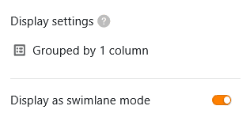
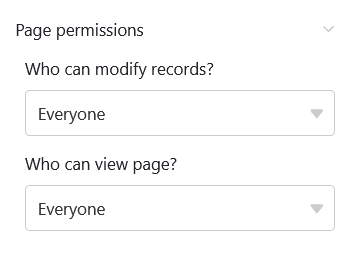

Ce type de page présente une grande similitude avec le [plug-in Timeline]() et vous permet d'afficher différentes périodes de temps sous la forme d'une **ligne de temps**. Étant donné que cette vue des données révèle les chevauchements de dates, la **planification des congés dans une entreprise**, par exemple, pourrait être un cas d'application concret.

## Paramètres de la page

Si vous souhaitez modifier les paramètres d'une page, cliquez dans la navigation sur le **symbole de la roue dentée**  correspondant.

Dans les **paramètres de la page**, vous pouvez tout d'abord régler la représentation graphique des lignes de temps. Pour cela, choisissez la [couleur des lignes]() ou une [colonne de sélection simple]() qui détermine la **couleur des blocs**. Vous pouvez également définir une colonne pour le **libellé des blocs**.

Pour définir la période des entrées, vous avez besoin d'une [colonne de date]() pour la **date de début**. Pour la **date de fin**, vous pouvez utiliser une autre colonne de date ou une colonne numérique – [nombre](), [durée]() ou [formule]() – qui indique le nombre de jours. Vous pouvez également sélectionner la **plage temporelle**, c’est-à-dire le nombre d’années que doit couvrir la frise chronologique.

## Filtres prédéfinis et colonnes masquées

Vous pouvez définir **des filtres prédéfinis** et **des colonnes masquées** afin de limiter les données affichées pour les utilisateurs. Pour ce faire, cliquez sur **Ajouter un filtre**, sélectionnez la **colonne** et la **condition** souhaitées et confirmez en cliquant sur **Envoyer**.

Les utilisateurs peuvent afficher plus d'informations sur une entrée en cliquant sur un bloc de la frise chronologique. Décidez donc quelles données doivent être **visibles** et affichez ou masquez les colonnes correspondantes à l'aide des **curseurs**.



Si vous ajoutez un **regroupement**, l'affichage des barres peut également se faire en **swimlanes**. Pour les activités qui ne se chevauchent pas, cette option d'affichage permet d'obtenir une représentation compacte et claire.

## Modifier ou déplacer une entrée sur la ligne du temps

Vous pouvez modifier des entrées très facilement en cliquant sur une **barre** et en effectuant les modifications souhaitées dans les **détails de la ligne** qui s'ouvrent.

De plus, vous pouvez **prolonger** ou **raccourcir** la **période** directement sur la ligne du temps. Pour ce faire, saisissez le **bord** droit ou gauche **de la barre** et faites-la glisser jusqu'à la date souhaitée.

De plus, vous pouvez facilement **déplacer** les entrées sur la ligne du temps **par glisser-déposer**. SeaTable ajuste automatiquement les **dates**.

## Autorisations des pages

Tout en bas, dans les paramètres de la page, vous pouvez limiter les personnes autorisées à **voir** la page de la ligne du temps et **à modifier les** entrées. Vous ne pouvez pas ajouter ou supprimer de lignes via les pages de la ligne du temps.

