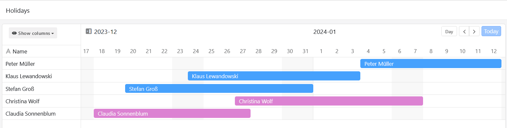
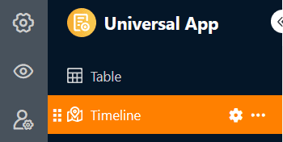
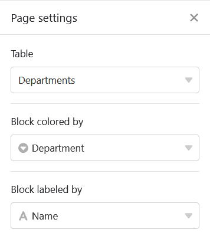
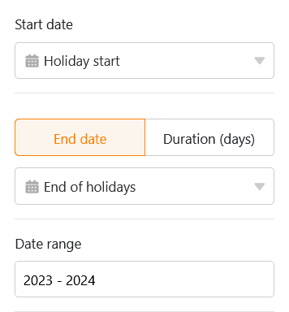
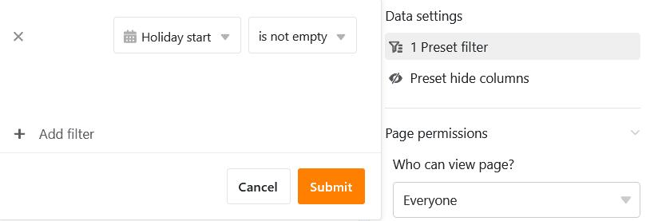
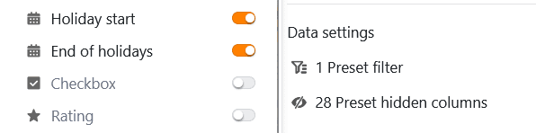
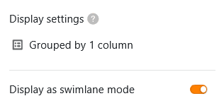
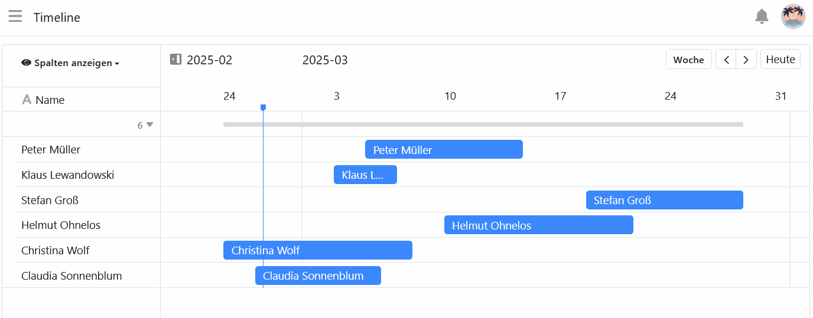
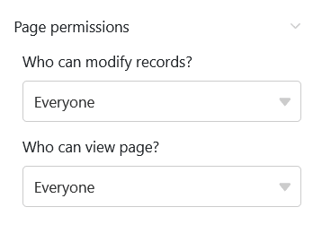

Этот тип страницы очень похож на [плагин timeline]() и позволяет отображать различные временные отрезки в виде **временной шкалы**. Поскольку такое представление данных показывает пересекающиеся даты, то, например, **планирование праздников в компании** может быть специфическим вариантом использования.

## Настройки страницы

Если вы хотите изменить настройки какой-либо страницы, нажмите на соответствующий **символ**  на панели навигации.

В **настройках страницы** вы можете задать графическое представление временных линий. Для этого выберите [цвет строки]() или [одного столбца выделения](), который определяет **цвет блоков**. Вы также можете задать столбец для **маркировки блоков**.

Чтобы определить период записей, вам понадобится [столбец даты]() или [формула](), в котором указывается количество дней. Вы также можете выбрать **временной интер** вал, то есть сколько лет должна охватывать временная шкала.

## Предустановленные фильтры и скрытые колонки

Вы можете задать **предустановленные фильтры** и **скрытые столбцы**, чтобы ограничить отображение данных для пользователей. Для этого нажмите кнопку **Добавить фильтр**, выберите нужный **столбец** и **условие** и подтвердите выбор кнопкой **Отправить**.

Пользователи могут просмотреть дополнительную информацию о записи, нажав на блок на временной шкале. Поэтому решите, какие данные должны быть **видны**, и покажите или скройте соответствующие столбцы с помощью **ползунков**.



Если вы добавите **группировку**, столбики также можно отобразить в виде **"плавающих линий"**. Для непересекающихся видов деятельности этот вариант просмотра обеспечивает компактное и четкое отображение.

## Редактирование или перемещение записи на шкале времени

Вы можете легко редактировать записи, щелкнув по **строке** и внеся нужные изменения в открывшихся **деталях строки**.

Вы также можете **увеличивать** или **уменьшать** **временной интер** вал непосредственно на шкале времени. Для этого возьмитесь за правый или левый **край полосы** и перетащите ее на нужную дату.

Вы также можете удобно **перемещать** записи на временной шкале с **помощью перетаскивания**. SeaTable автоматически корректирует соответствующие **значения дат**.

## Разрешения на страницы

В нижней части настроек страницы можно ограничить круг лиц, которые могут **просматривать** страницу временной шкалы и **редактировать** записи. Добавлять и удалять строки на страницах временной шкалы нельзя.

