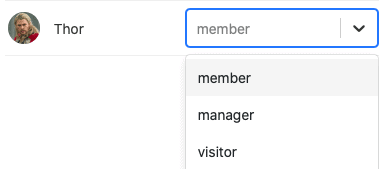
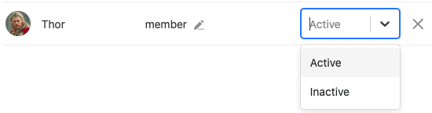

Whether it is adding **new users**, assigning **roles** or creating **invitation links** - you can perform various administrative activities in the user and role administration of a universal app. You can access the **user and role administration** via the edit mode of your universal app.



## User and role management of the Universal App

1. Open a **Base** to which you have already added a Universal App.
2. Click **Apps** in the Base header.

4. Hover your mouse over the app and click the **pencil icon** .

6. Open the **user and role administration** at the top left of the page.

8. Make the desired **settings**.

## The settings in detail

### User

In the first section you will find an overview of all **users** who have access to your Universal App. In addition, you will also find the **role** and **status of** the respective user.

This section also provides you with various options for **managing the current users of** your universal app.

Use the **search function to** find a specific user. This feature can be especially helpful if you have a large number of app users.

To add a user to the app, click **Import User**, search for the **user** using the input field, and then assign a role to the user.

Click **Synchronize users with Base** to automatically collect the **app users** in a table of your Base.

  

If you add more users this way in the future, you can always click **Synchronize users with Base** again to add the **new users** to the table.

To **delete** a user from the app, simply click on the **X icon**, which you can find to the right of the status of the respective user.

By clicking on the **pen icons** , which you can find for each user, you can edit their **role** and **status**.



For the **role of a user you** can choose from all roles in the drop-down menu, which you can define in the next section of the user and role administration.

The **status of** a user can be set to **Active** or **Inactive**. While **active** users have access to the app and its content, **inactive** users lose this access.

Users who do not have access to your Universal App will see this message:

### Rollers

In this section you can define any number of **roles**, which you can assign to different app users in the section above.

Here you initially define only the **names of** the roles. You can define which **permissions** users with the different roles have individually for each page of the app.

[Learn more about page permissions here.](https://seatable.io/en/docs/apps/seitenberechtigungen-in-einer-universellen-app/)

### Invitation link

In the third section of User and Role Management, you can generate an individual **invitation link** for the Universal App.

First, define the **role of** the users who will access the app using the invitation link.

Afterwards, you have the option to set a **password** that must be entered after opening the invitation link in order to gain access to the app.

Optionally, you can also add an automatic **expiration time to** the invitation link, how long it is valid.

With a click on **Generate** you can have the invitation link created. The link will be displayed below and you have the option to **copy** or **delete** it.

Alternatively, you have the option to generate a **QR code** to open and share the Universal App.

Scan the displayed **QR code** to open your Universal App or share it with other users to give them **access to** your app.

