Ya sea añadiendo **nuevos usuarios**, asignando **roles** o creando **enlaces de** invitación, puedes llevar a cabo varias actividades administrativas en la administración de usuarios y roles de una app universal. Puedes acceder a la administración de usuarios y **roles** a través del modo de edición de tu app universal.



## Administración de usuarios y funciones de la aplicación universal

1. Abra una **Base** a la que ya haya añadido una aplicación universal.
2. Haga clic en **Aplicaciones** en la cabecera Base.

4. Pase el ratón por encima de la aplicación y haga clic en el **icono del lápiz** .

6. Abra la **administración de usuarios y funciones** en la parte superior izquierda de la página.

8. Realice los **ajustes** deseados.

## Los ajustes en detalle

### Usuario

En la primera sección encontrará un resumen de todos los **usuarios** que tienen acceso a su Universal App. Además, también encontrará la **función** y el **estado** del usuario correspondiente.

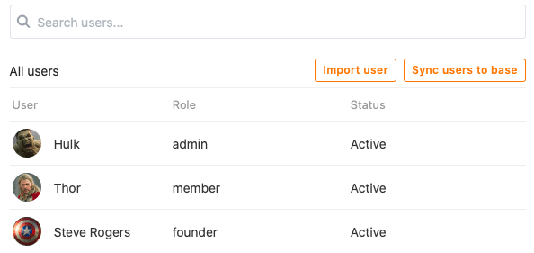

Esta sección también le ofrece varias opciones para **gestionar los usuarios actuales de** su aplicación universal.

Utilice la función de **búsqueda para** encontrar un usuario concreto. Esta función puede ser especialmente útil con un gran número de usuarios de la app.

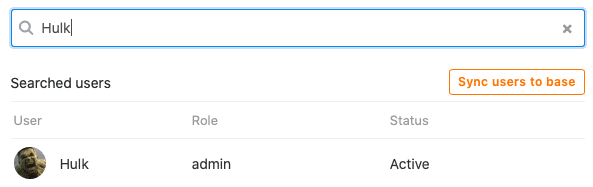

Para añadir un usuario a la aplicación, haga clic en **Importar usuario**, busque el usuario en el campo de entrada y asígnele una función.

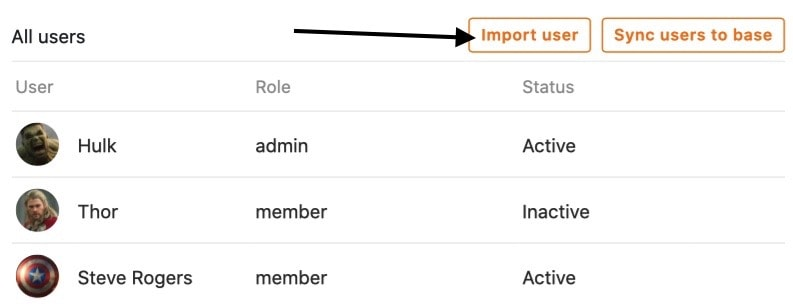

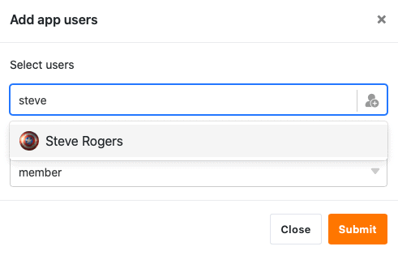

Haga clic en **Sincronizar usuarios con Base** para recopilar automáticamente los **usuarios de la App** en una tabla de su Base.

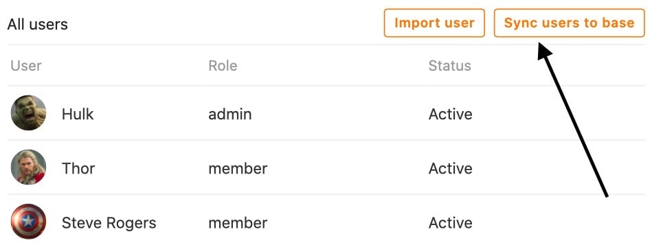  
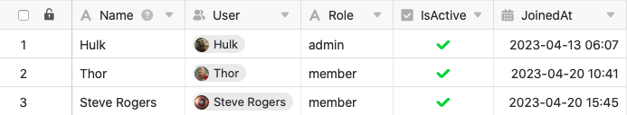

Si en el futuro añades más usuarios de esta forma, siempre puedes volver a hacer clic en **Sincronizar usuarios con Base** para añadir los **nuevos usuarios** a la tabla.

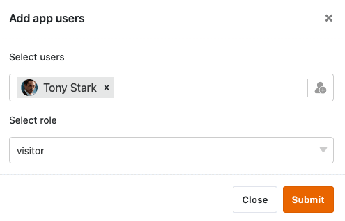

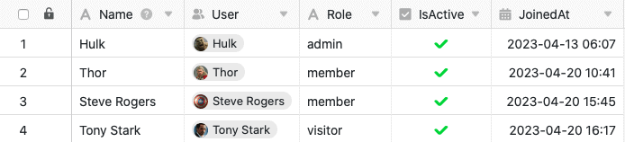

Para **eliminar** un usuario de la aplicación, basta con hacer clic en el **símbolo X**, que encontrará a la derecha del estado del usuario en cuestión.

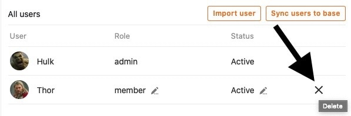

Haciendo clic en los **iconos de lápiz** , que encontrará para cada usuario, podrá editar su **función** y su **estado**.



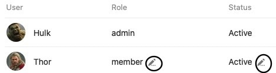

Para la **función de un usuario,** todas las funciones están disponibles para su selección en el menú desplegable, que puede definir en la siguiente sección de la administración de usuarios y funciones.

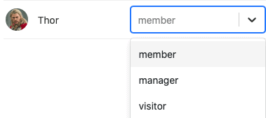

El **estado de** un usuario puede ser **Activo** o **Inactivo**. Mientras que los usuarios **activos** tienen acceso a la app y a su contenido, los **inactivos** pierden este acceso.

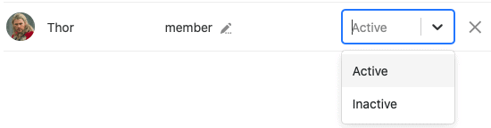

Los usuarios que no tengan acceso a su Universal App verán este mensaje:

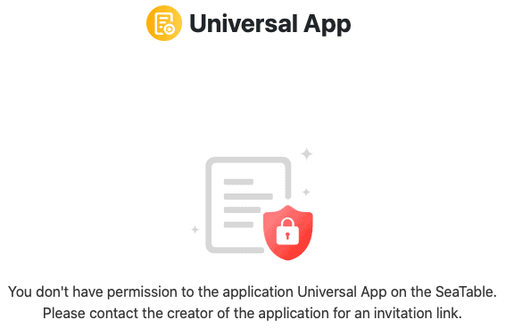

### Rodillos

En esta sección puede definir cualquier número de **roles**, que puede asignar a los distintos usuarios de la aplicación en la sección anterior.

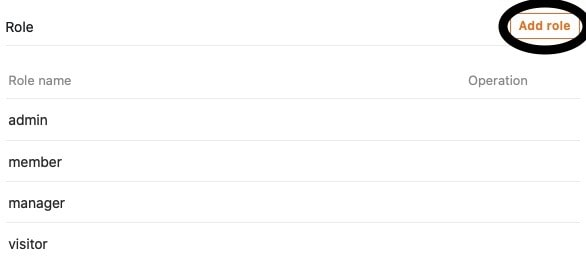

Aquí inicialmente sólo se definen los **nombres de** los roles. Puedes definir qué **permisos** tienen los usuarios con los diferentes roles individualmente para cada página de la app.

[Obtenga más información sobre los permisos de página aquí.](https://seatable.io/es/docs/apps/seitenberechtigungen-in-einer-universellen-app/)

### Enlace de invitación

En la tercera sección de la administración de usuarios y roles, puede generar un **enlace de invitación** individual para la Universal App.

En primer lugar, defina la **función de** los usuarios que acceden a la aplicación mediante el enlace de invitación.

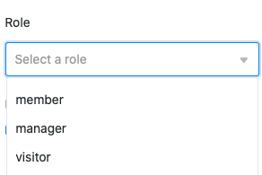

A continuación, tiene la opción de establecer una **contraseña** que deberá introducir tras abrir el enlace de invitación para poder acceder a la aplicación.

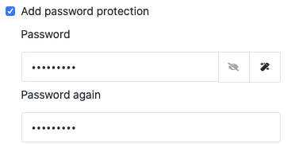

Opcionalmente, también puede añadir un **tiempo de caducidad** automático al enlace de invitación en cuanto a la duración de su validez.

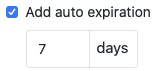

Haga clic en **Generar** para crear el enlace de invitación. El enlace se muestra a continuación y tiene la opción de **copiarlo** o **eliminarlo**.

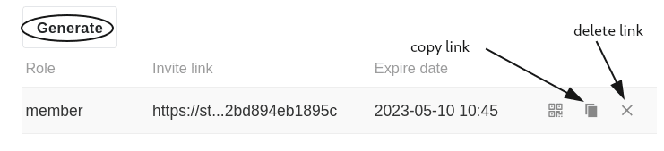

También tiene la opción de generar un **código QR** para abrir y compartir la aplicación universal.

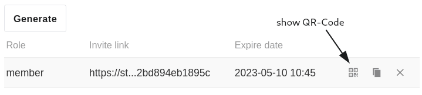

Escanee el **código QR** mostrado para abrir su aplicación universal o compártalo con otros usuarios para darles **acceso a** su aplicación.

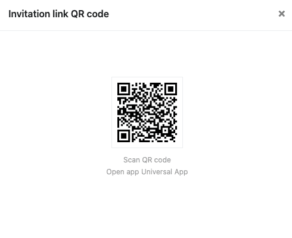
