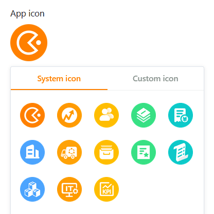

You can make **visual settings** for each [universal app](https://seatable.io/en/docs/apps/universelle-app/) to adapt the app to your personal wishes or the corporate design of your company. The branding options include the **mode**, **color** and **icon** of a universal app.

## Change the design settings of a universal app

1. Open a **base** in which you want to edit an existing app.
2. Click **Apps** in the Base header.

4. Hover your mouse over the app and click the **pencil icon** .

6. Click on the **palette icon** at the top left of the page.

8. Make the desired adjustments to the **visual settings (mode, color and icon)** of the universal app.



## Setting the mode, color and icon of the universal app

As soon as you have clicked on the **palette icon**, a new window opens. Here you can make various settings that affect the appearance of the app. Choose between **light and dark mode** and decide on a **color scheme**.

When selecting a suitable **app icon**, you can upload and use your own **user-defined icon** in addition to the **system icons** already available in various colors.

## Edit visual settings of individual pages

The settings mentioned so far affect an **entire Universal App**. If you want to change the settings of a **single page**, click the **gear icon**  of the corresponding page in the navigation.

Currently, the [individual page](https://seatable.io/en/docs/seitentypen-in-universellen-apps/individuelle-seiten-in-universellen-apps/) in particular offers numerous additional design settings. For example, you can define different colors for backgrounds, fonts, lines and frames for the elements. Use the practical **color picker** for this.

