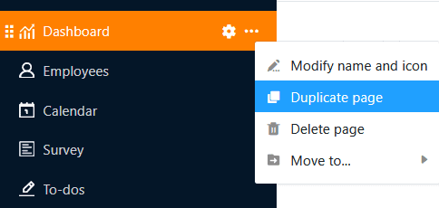

In a Universal App you can create as many **pages** and **folders** as you like to make the data in a Base accessible to a specific user group, to organize it and to present it in an appealing way. There are a variety of [page types](https://seatable.io/en/docs/apps/seitentypen-in-der-universellen-app/) that you already know from other places in SeaTable and can create in your Universal App with just a few clicks.



## Create a new page in a universal app

1. Open a **Base** to which you have already added a Universal App.
2. Click **Apps** in the Base header.

4. Hover your mouse over the Universal App and click the **pencil icon** .

6. Click **Add Page or Add Folder**, and then select **Add Page**.

8. Select one of the [page types](https://seatable.io/en/docs/apps/seitentypen-in-der-universellen-app/) and click **Next**.

10. Give the page a **name**, define the underlying **table** and optionally specify an **icon** for the page.

12. Confirm with **Submit**.

## Edit the name and icon of a page

When creating new pages, it often has to be done quickly and you spontaneously choose a name that you want to change later. This is why you can **rename pages** at any time using the **three dots** and also change the page **icon** in this way.

## Duplicate page

The configuration of pages in the Universal App Builder can take a lot of time - especially for individual pages such as dashboards. If you have already created pages that you only want to modify slightly, the Universal App Builder offers a function that will save you a lot of time and effort: Click on the **three dots** and select **Duplicate page**. The copy takes over all content, settings and authorizations one-to-one from the original page.

## Delete page

You can **delete** pages that are no longer required from your universal app at any time. Please note that the deletion is final and deleted pages **cannot** be restored. However, the **data** will of course remain **stored** in the underlying base.

## Move page

If you have already created a **folder** in your universal app, you can move your pages to it using the **three dots**.

Alternatively, you can also move pages **using drag-and-drop**. To do this, hold down the mouse button on the **six dots** in front of the page icon, drag the page to the desired position in the navigation and release.

## Create a new folder in a universal app

If there are a large number of pages, **folders** are helpful to group the pages thematically and make navigation clearer for users.

1. Open a **Base** to which you have already added a Universal App.
2. Click **Apps** in the Base header.

4. Hover your mouse over the Universal App and click the **pencil icon** .

6. Click **Add Page or Add Folder**, and then select **Add Folder**.

8. **Name the** folder and optionally choose a suitable **icon** for it.

10. Confirm with **Submit**.

## Add page to folder

If you have already created a folder in your universal app, you can click on the **three dots** in this folder and **add** a **page** directly.

## Edit the name and icon of a folder

You can **rename** folders in your Universal App at any time using the **three dots**. In addition, you can also customize the **icon of** your folder this way.

## Delete folder

You can **delete** folders that are no longer required from your universal app at any time. Please note that **all pages** in the folder will also be **deleted**. The deletion is final. This means that neither the folder nor the individual pages can **be** restored afterwards.

## Move folder

You can only move folders **using drag-and-drop**. To do this, hold down the mouse button on the **six dots** in front of the folder icon, drag the folder to the desired location in the navigation and release.

