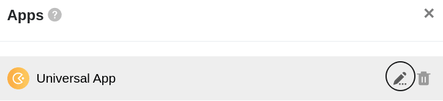
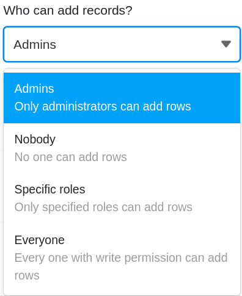
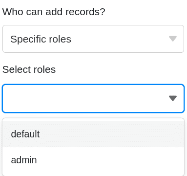

Para controlar con precisión el **acceso a sus datos**, puede establecer **permisos de página individuales para** cada página que haya creado en una aplicación universal. Los permisos se editan a través de la configuración de la página.

## Establecer y editar permisos de página

1. Abra una **Base** a la que ya haya añadido una aplicación universal.
2. Haga clic en **Aplicaciones** en la cabecera Base.

4. Pase el ratón por encima de la aplicación universal y haga clic en el **icono del lápiz** .

6. Seleccione la **página** deseada en la navegación de la parte izquierda de la página y haga clic en el **símbolo de la rueda dentada** .

8. Establezca los **permisos** deseados en los **ajustes de página** que aparecen en la parte derecha de la **página**.

10. Los permisos de página definidos se guardan **automáticamente** y se aplican **de inmediato**.

## Qué autorizaciones de página están disponibles

Puede establecer los siguientes permisos de página:

- ¿Quién puede añadir líneas?
- ¿Quién puede editar las líneas?
- ¿Quién puede suprimir líneas?
- ¿Quién puede ver la página?

No todas las autorizaciones de página están disponibles para todos los [tipos de página](https://seatable.io/es/docs/universelle-apps/seitentypen-in-der-universellen-app/). Por ejemplo, en las páginas individuales sólo existe la autorización _"¿Quién puede ver la página?"_ porque, por lo general, los usuarios no pueden añadir, editar o eliminar entradas en ellas.

## A qué grupos de usuarios puede autorizar

Para cada permiso, puede elegir entre las siguientes opciones para limitar el grupo de personas: **Nadie**, **Administradores**, **Roles específicos** y **Todos**.

Seleccione la opción **Roles específicos** para definir sus propios roles. Para ello, cree previamente nuevos **roles** para grupos de usuarios individuales en la [administración de usuarios y roles](https://seatable.io/es/docs/apps/benutzer-und-rollenverwaltung-einer-universellen-app/), a los que podrá asignar permisos individualmente en cada página de la Universal App.

