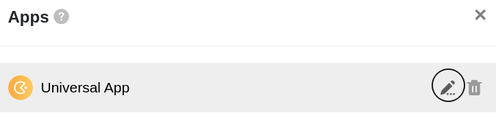
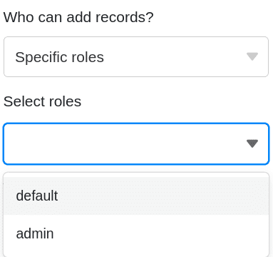

Pour contrôler précisément l'**accès à vos données**, vous pouvez définir **des autorisations de page individuelles** pour chaque page que vous avez créée dans une application universelle. L'édition des autorisations se fait via les paramètres de la page.

## Définir et modifier les autorisations de pages

1. Ouvrez une **base** à laquelle vous avez déjà ajouté une application universelle.
2. Cliquez sur **Apps** dans l'en-tête de la base.

4. Passez la souris sur l'application universelle et cliquez sur l'**icône en forme de crayon** .

6. Sélectionnez la **page** souhaitée dans la navigation sur le bord gauche de la page et cliquez sur l'**icône en forme de roue dentée** .

8. Définissez les **autorisations** souhaitées dans les **paramètres de page** apparaissant sur le bord droit de la page.

10. Les autorisations de pages définies sont **automatiquement** enregistrées et **immédiatement** appliquées.

## Quelles sont les autorisations de page ?

Vous pouvez définir les autorisations de page suivantes :

- Qui peut ajouter des lignes ?
- Qui peut modifier les lignes ?
- Qui peut supprimer des lignes ?
- Qui peut voir la page ?

Toutes les autorisations de pages ne sont pas disponibles pour tous les [types de pages](https://seatable.io/fr/docs/universelle-apps/seitentypen-in-der-universellen-app/). Par exemple, les pages individuelles ne disposent que de l'autorisation _"Qui peut voir la page ?_ car les utilisateurs ne peuvent généralement pas y ajouter, modifier ou supprimer des entrées.

## Quels groupes d'utilisateurs vous pouvez autoriser

Pour chaque autorisation, vous avez le choix entre les options suivantes, qui vous permettent de limiter le cercle de personnes : **Personne**, **Administrateurs**, **Rôles spécifiques** et **Tout le monde**.

Sélectionnez l'option **Rôles spécifiques** pour définir des rôles que vous avez vous-même définis. Pour ce faire, créez au préalable dans la [gestion des utilisateurs et des rôles](https://seatable.io/fr/docs/apps/benutzer-und-rollenverwaltung-einer-universellen-app/) de nouveaux **rôles** pour des groupes d'utilisateurs individuels, auxquels vous pourrez attribuer individuellement des autorisations sur chaque page de l'application universelle.

