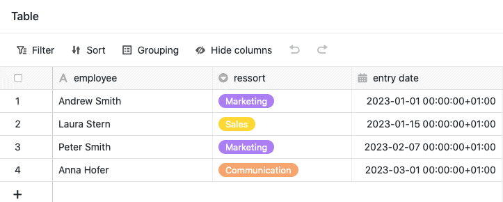
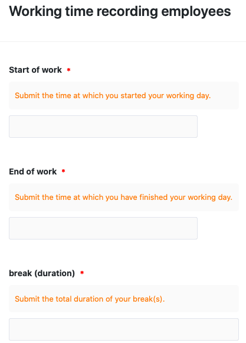
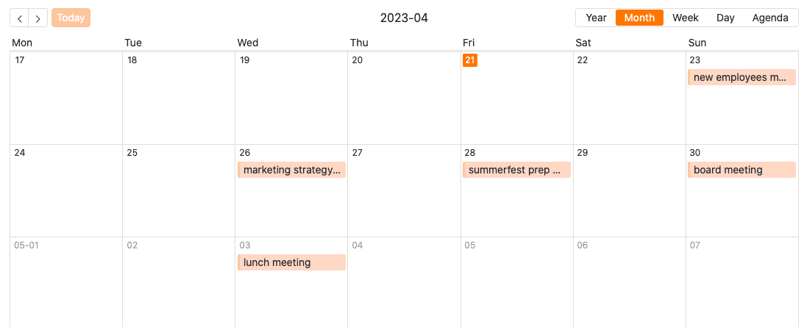
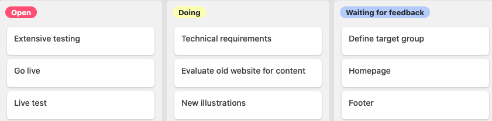
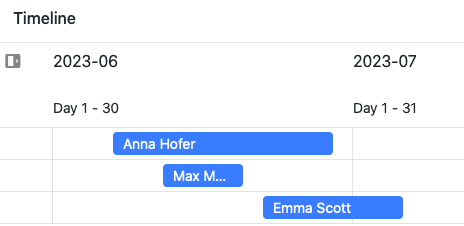
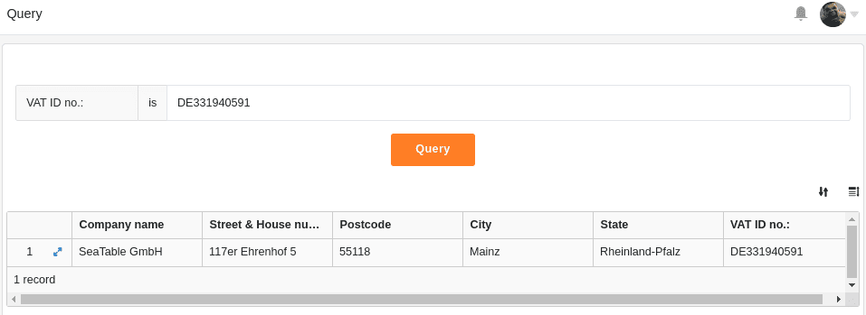

В режиме редактирования **универсального приложения** вы можете выбрать один из различных **типов страниц** для оформления вашего приложения. Вы уже знаете большинство типов страниц в похожей форме из других мест в SeaTable.

В этой обзорной статье вы узнаете о доступных типах страниц и их различных вариантах использования.

## Типы страниц в универсальном приложении

В настоящее время в режиме редактирования универсального приложения можно выбрать один из **девяти типов страниц**.

[Узнать, как создавать новые страницы в универсальном приложении, можно здесь.](https://seatable.io/ru/docs/apps/seiten-und-ordner-in-einer-universellen-app-anlegen-und-verwalten/)

Чтобы отредактировать существующие страницы, нажмите на **символ шестеренки**  соответствующей страницы в навигации.

## Тип страницы: Таблица

Вы можете использовать этот тип страницы для добавления любой **таблицы** из вашей базы в качестве страницы в ваше универсальное приложение. Вы можете использовать [полномочия страницы](https://seatable.io/ru/docs/universelle-apps/seitenberechtigungen-in-einer-universellen-app/), чтобы контролировать, кто именно может видеть и редактировать данные на этой странице. Вы также можете задать **предустановленные фильтры**, **сортировку**, **группировки**, **скрытые и доступные только для чтения столбцы**, чтобы настроить, ограничить и упорядочить отображаемые данные именно для той или иной группы пользователей.

[Узнайте больше о табличных страницах в универсальных приложениях.](https://seatable.io/ru/docs/seitentypen-in-universellen-apps/tabellenseiten-in-universellen-apps/)

## Тип страницы: Форма

Вы можете использовать этот тип страницы для создания различных **форм**, которые пользователи могут отправлять. [Веб-формы](https://seatable.io/ru/docs/webformulare/webformulare/) доступны не только в универсальном приложении, но и как отдельная функция. Страницы форм в универсальном приложении идеально подходят для сбора **данных от разных пользователей**. Один из возможных вариантов использования - [учет рабочего времени ваших сотрудников](https://seatable.io/ru/arbeitszeiterfassung/).

[Узнайте больше о страницах форм в универсальных приложениях.](https://seatable.io/ru/docs/seitentypen-in-universellen-apps/formularseiten-in-universellen-apps/)

## Тип страницы: Галерея

С помощью этого типа страницы вы можете отображать **изображения**, которые вы сохранили в [колонке изображений](https://seatable.io/ru/docs/dateien-und-bilder/die-bild-spalte/) вашей таблицы, в виде **галереи**. В галерее можно также отображать другие **данные** из вашей таблицы. Например, вы можете использовать страницу галереи для наглядных **профилей ваших сотрудников**.

  
[Узнайте больше о страницах галереи в универсальных приложениях.](https://seatable.io/ru/docs/seitentypen-in-universellen-apps/galerieseiten-in-universellen-apps/)

## Тип страницы: Календарь

Этот тип страницы работает подобно [плагину календаря](https://seatable.io/ru/docs/plugins/anleitung-zum-kalender-plugin/) и позволяет отображать записи из одной или двух [колонок даты](https://seatable.io/ru/docs/datum-dauer-und-personen/die-datum-spalte/) вашей таблицы в виде **календаря**. Конкретным примером использования может быть, например, отображение в календаре предстоящих **встреч**.

[Узнайте больше о страницах календаря в универсальных приложениях.](https://seatable.io/ru/docs/seitentypen-in-universellen-apps/kalenderseiten-in-universellen-apps/)

## Тип страницы: Отдельная страница

С помощью этого типа страницы вы можете дать волю своему творчеству и создать **индивидуальную страницу** в соответствии с вашими пожеланиями. Добавляйте на страницу **текст** и **изображения** или используйте [статистику](https://seatable.io/ru/docs/plugins/anleitung-zum-statistik-plugin/) для создания содержательных **информационных панелей** с данными из вашей базы.

[Узнайте больше об отдельных страницах в универсальных приложениях.](https://seatable.io/ru/docs/seitentypen-in-universellen-apps/individuelle-seiten-in-universellen-apps/)

## Тип страницы: Канбан

Этот тип страницы работает аналогично [плагину Kanban](https://seatable.io/ru/docs/plugins/anleitung-zum-kanban-plugin/) и позволяет отображать записи в виде индексных карточек на **доске Kanban**. Для этого укажите столбец, по которому должны быть **сгруппированы** записи. В качестве конкретного случая использования можно использовать, например, **визуализацию рабочих процессов и хода выполнения проекта**.

[Узнайте больше о страницах Kanban в Universal Apps.](https://seatable.io/ru/docs/seitentypen-in-universellen-apps/kanbanseiten-in-universellen-apps/)

## Тип страницы: Временная шкала

Этот тип страницы очень похож на [плагин Timeline](https://seatable.io/ru/docs/plugins/anleitung-zum-timeline-plugin/) и позволяет отображать различные временные промежутки в виде **временной шкалы**. Конкретным примером может быть, например, **планирование праздников в компании**.

[Узнайте больше о страницах временной шкалы в универсальных приложениях.](https://seatable.io/ru/docs/seitentypen-in-universellen-apps/zeitstrahlseiten-in-universellen-apps/)

## Тип страницы: Запрос

Этот тип страницы, работающий аналогично [приложению "Запрос данных"](https://seatable.io/ru/docs/apps/datenabfrage-app/), позволяет искать в записях по определенным полям конкретные значения. Этот тип страницы особенно полезен для **больших наборов данных**, таких как каталоги продукции или библиотеки. Конкретным примером использования может быть, например, запрос идентификационных номеров.

[Узнайте больше о страницах запросов в универсальных приложениях.](https://seatable.io/ru/docs/seitentypen-in-universellen-apps/abfrageseiten-in-universellen-apps/)

## Тип страницы: одиночная запись данных

Этот тип страницы позволяет оформить страницу со статическими элементами, динамическими полями таблицы, цветами, рамками и т. д., чтобы наглядно представить данные, хранящиеся в строке. Таким образом, этот тип страницы похож на [плагин дизайна страниц](https://seatable.io/ru/docs/seitendesign-plugin/anleitung-zum-seitendesign-plugin/), который вы уже знаете по Base.

Пользователи приложения могут просматривать, искать или редактировать отдельные записи данных на этой странице. Таким образом, этот тип страницы подходит, например, для отображения данных в базе данных сотрудников в виде **личных профилей**.

[Подробнее о страницах с типом набора данных Single в универсальных приложениях.](https://seatable.io/ru/docs/seitentypen-in-universellen-apps/seiten-vom-typ-einzelner-datensatz-in-universellen-apps/)
