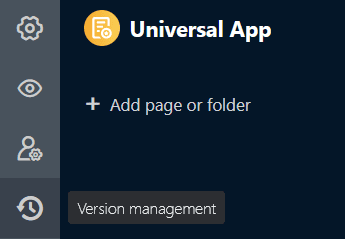
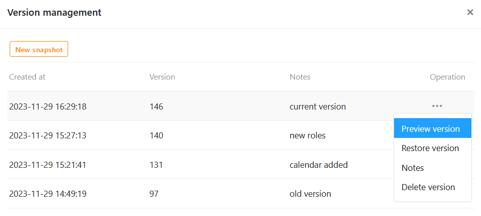
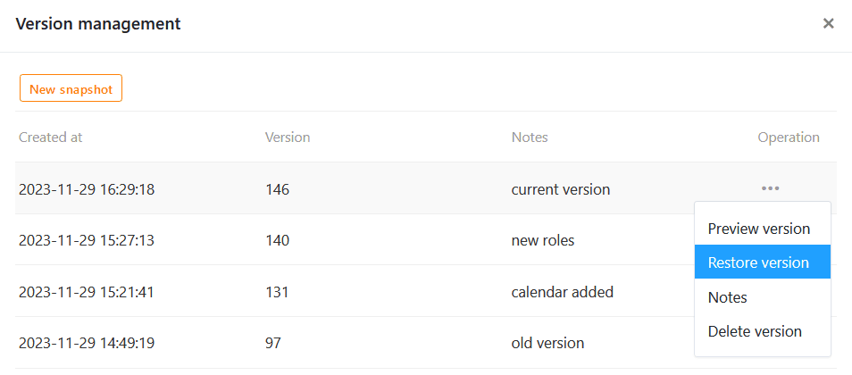
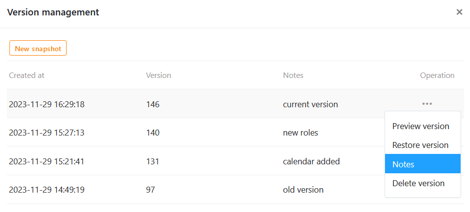
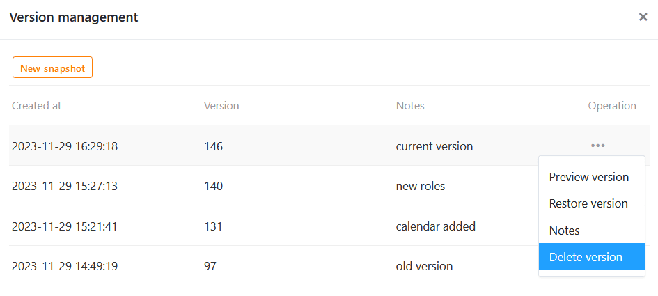

Les **snapshots** permettent de sauvegarder la version actuelle d'une application universelle. Vous pouvez **créer**, **afficher**, **restaurer** et **supprimer** des snapshots dans la gestion des versions de l'Universal App Builder. Vous pouvez également noter **des notes** sur les différents snapshots afin de conserver des informations sur une version.



## Quand les apps snapshots sont utiles

Les App Snapshots sont des **instantanés** de l'état d'une application universelle et fonctionnent de manière similaire aux [Base Snapshots](https://seatable.io/fr/docs/historie-und-versionen/speichern-der-aktuellen-base-als-snapshot/). Les apps snapshots vous permettent de sauvegarder la version actuelle d'une application universelle, ce qui peut être utile si vous effectuez des modifications importantes et souhaitez éventuellement restaurer un état antérieur.



### Ce que stocke un snapshot d'application

Un snapshot d'application enregistre les éléments et paramètres suivants :

- [Paramètres](https://seatable.io/fr/docs/universelle-apps/einstellungen-einer-universellen-app-aendern/) tels que **le nom**, **l'icône** et **le schéma de couleurs** de l'application
- [Pages et dossiers](https://seatable.io/fr/docs/universelle-apps/seiten-und-ordner-in-einer-universellen-app-anlegen-und-verwalten/) de l'application
- Paramètres et [autorisations](https://seatable.io/fr/docs/universelle-apps/seitenberechtigungen-in-einer-universellen-app/) pour les différentes pages

### Ce qu'un snapshot d'application ne sauvegarde pas

Un snapshot d'application n'enregistre pas :

- l'**URL personnalisée** d'une application
- les **données** de la base sous-jacente
- les **commentaires** sur les différents enregistrements
- les [rôles des utilisateurs et les liens d'invitation](https://seatable.io/fr/docs/universelle-apps/benutzer-und-rollenverwaltung-einer-universellen-app/) de l'application

## Créer un snapshot de l'application

1. Ouvrez une **application universelle** en [mode édition](https://seatable.io/fr/docs/apps/apps-bearbeiten/).

3. Cliquez en haut à gauche de la page sur  **Gestion des versions**.

5. Une fenêtre s'ouvre. Créez-y un **nouveau snapshot**.
6. En option, vous pouvez ajouter une **note** au snapshot.
7. Confirmez en cliquant sur **Envoyer**.



Une fois que vous avez créé un snapshot, vous avez le choix entre quatre opérations :

- **Voir la version**
- **Restaurer la version**
- **Remarque**
- **Supprimer la version**

## Voir l'instantané de l'application

Avant de restaurer un snapshot et de revenir précipitamment à une autre version, vous devriez d'abord regarder cette version. Pour cela, suivez la même procédure que ci-dessus : Cliquez sur les **trois points** à l'extrémité droite d'un snapshot et sélectionnez l'opération **Voir la version** dans le menu déroulant.

## Restaurer un snapshot d'application

Pour restaurer un snapshot d'application, cliquez sur les **trois points** et sélectionnez l'opération correspondante dans le menu déroulant.



Dès que vous restaurez un instantané, l'application revient à l'état de la mémoire de cette version antérieure. Toutes les **modifications** que vous avez apportées depuis aux pages, dossiers et paramètres de l'application **seront perdues**. C'est pourquoi il est conseillé, avant de restaurer un snapshot, d'enregistrer également la version actuelle dans un snapshot. Vous pouvez ainsi passer d'une version à l'autre.

## Modifier une remarque

Si vous souhaitez ajouter, modifier ou supprimer ultérieurement la note d'une version, vous pouvez le faire à tout moment. Vous ouvrez le champ de texte correspondant en cliquant sur les **trois points** à l'extrémité droite d'un snapshot et en sélectionnant **Remarque** dans le menu déroulant. Enregistrez vos modifications en cliquant sur **Envoyer**.

## Supprimer un snapshot d'application

Vous pouvez à tout moment supprimer un snapshot dont vous n'avez plus besoin. Cliquez sur les **trois points** à l'extrémité droite d'un snapshot et sélectionnez l'opération **Supprimer la version** dans le menu déroulant.


