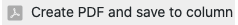
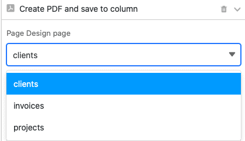
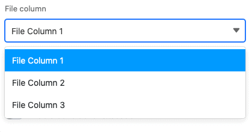
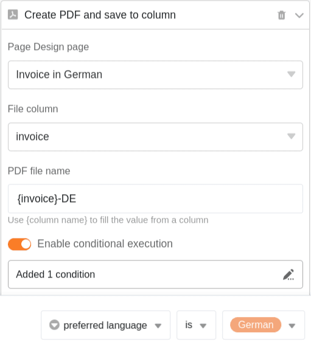
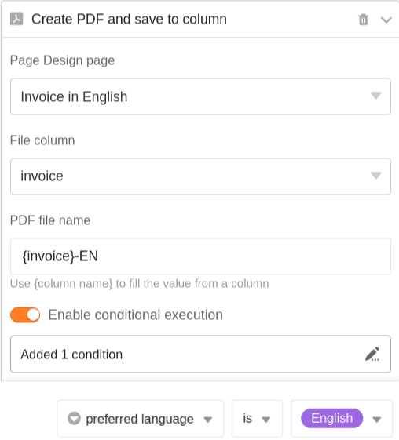

Using a **button** you can save PDF documents in file columns. This requires the **Page Design plugin** to be set up via the Base options.

## Save PDF documents via button in a column

Buttons allow you to save PDF documents in the [file columns of](https://seatable.io/en/docs/datei-und-bildanhaenge/die-datei-spalte/) your tables. The action is available when you create a button once you have set up the [page design plugin](https://seatable.io/en/?post_type=docs&p=19223) in the corresponding table.

In the first step you name the **column** and set the **label** and **color of** the button you want to add to your rows .

As action you set **"Save PDF file in column"** afterwards.

Next, select a **page** from the page design plugin to be saved as a PDF file. You can choose from existing pages or [add](https://seatable.io/en/?post_type=docs&p=19223) a new page first.



Now select the **file column** where you want to save the page as PDF.

Finally, **name** the PDF files that will be added to your table. Use **{column name}**, which is the name of a column in curly brackets, to name the file after the value in that column.

After clicking the button, the selected **PDF file** will be added to the corresponding row .

## Conditional execution of button actions

You have the possibility to define the action **Save PDF file** in column **several times** in one button. For each action, you can define a specific **condition** that must be met in order to save a PDF file to the column when the button is clicked. In addition, for each action you can select a different **page** from the page design plugin to save as PDF.

For example, you can use this feature to save a document in different languages with a single button. Create multiple actions, for each of which you select a template in different **languages**, and define the condition that depending on the language of the customer, the **appropriate template** is saved as a PDF in the column.

This would be the action to attach a German document:

And this the action to attach an English document:

