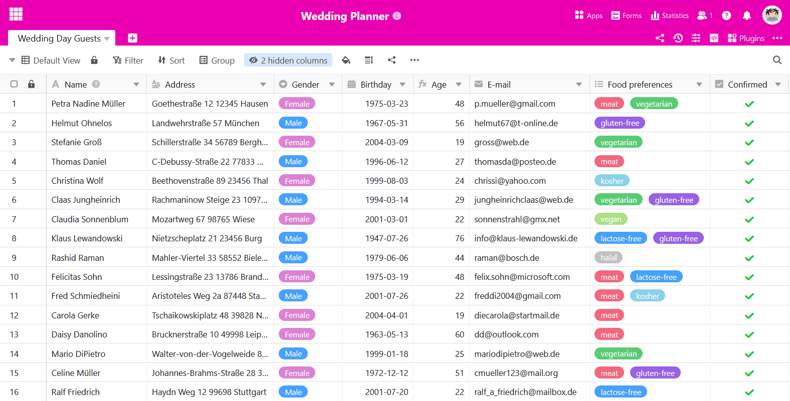
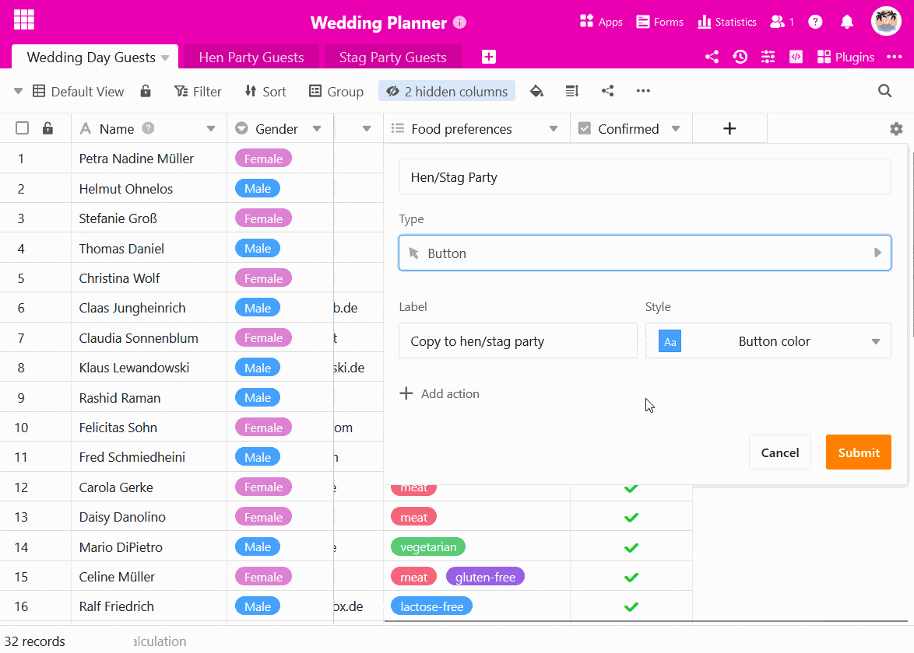
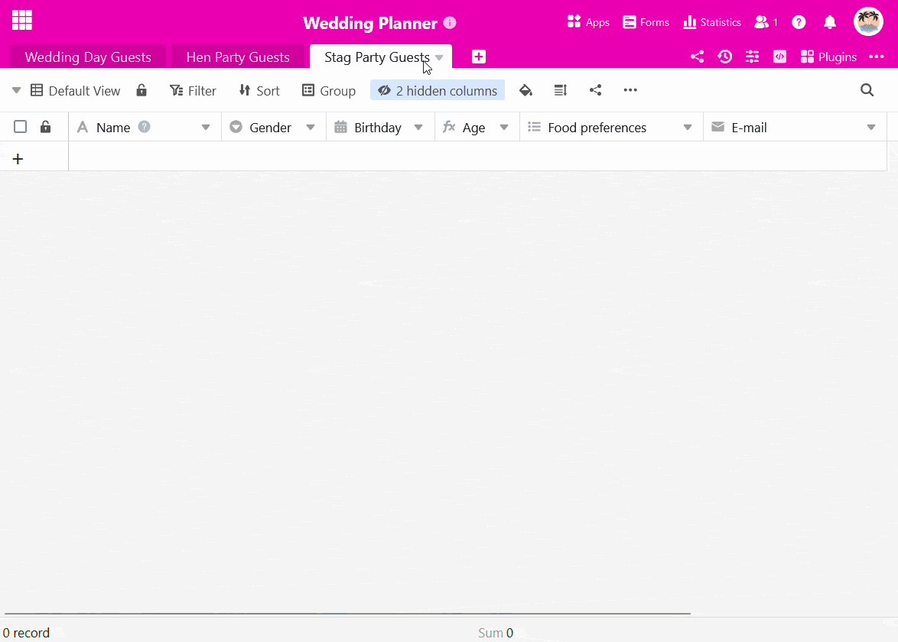

É possível utilizar um **botão** para **copiar linhas para outras tabelas**. Isto é útil se precisar de determinados registos de dados em tabelas diferentes, mas não quiser utilizar [uma ligação](https://seatable.io/pt/docs/verknuepfungen/wie-man-tabellen-in-seatable-miteinander-verknuepft/). As instruções seguintes ilustram o caso de utilização através de um exemplo.

## Exemplo de aplicação

Está a planear uma **receção de casamento** e já elaborou uma lista de convidados.

Agora também quer organizar a próxima despedida de **solteira** da noiva e a despedida de **solteiro** do noivo. Por conseguinte, pretende copiar os dados dos convidados para duas tabelas adicionais depois de estes terem confirmado a sua presença - consoante o sexo do convidado.

## Criar tabelas adequadas

Criar duas novas tabelas para as respectivas listas de convidados da festa.



**Sugestão:** Um método simples de adotar a estrutura da tabela original é **duplicar a tabela sem as entradas existentes**.

Nas tabelas vazias, é claro que pode eliminar as colunas que não são necessárias ou adicionar novas colunas numa data posterior.

## Criar o botão

1. Clique no **símbolo de mais** grande na extremidade direita do cabeçalho da tabela.
2. Dê um **nome** à coluna e seleccione _Botão_ como o **tipo de coluna**.
3. Em seguida, defina a **etiqueta** e a **cor do botão**.
4. No passo seguinte, defina o número de **acções** que devem ser desencadeadas pela ativação do botão. No nosso caso, seleccione **Copiar linha para outra tabela**.

6. Seleccione a **tabela** para a qual as linhas devem ser copiadas.
7. Pode definir **filtros** para ligar a execução de acções de botões a **condições**.
8. Confirmar a criação do botão com **Enviar**.

## Execução condicional de acções de botão

No nosso exemplo de aplicação, os convidados do sexo feminino devem ser copiados para a tabela "Convidados da festa da galinha" e os convidados do sexo masculino para a tabela "Convidados da festa do veado" quando o botão é premido. Para tal, cria-se **duas vezes a mesma ação**, que é equipada com **condições de fil** tragem opostas. Isto permite-lhe copiar os convidados para mesas diferentes, consoante o sexo, com um único botão.



## A automatização como opção adicional

Se tiver uma subscrição SeaTable Enterprise, também pode automatizar totalmente esta etapa do processo. Para tal, configure uma [automatização](https://seatable.io/pt/docs/beispiel-automationen/eintraege-in-andere-tabellen-per-automation-hinzufuegen/) correspondente [com a qual pode adicionar entradas noutras tabelas](https://seatable.io/pt/docs/beispiel-automationen/eintraege-in-andere-tabellen-per-automation-hinzufuegen/).
