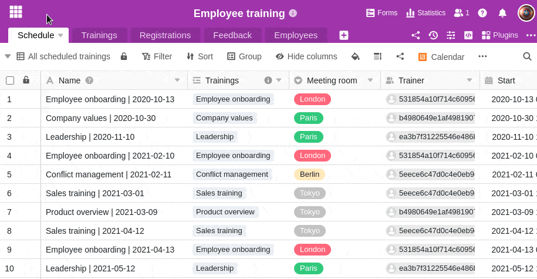

En SeaTable puede crear y guardar diferentes vistas para sus tablas. Por ejemplo, si desea filtrar una tabla por un determinado valor, puede guardar la vista filtrada de la tabla y así acceder a ella más rápidamente en el futuro sin tener que volver a filtrar.  
Además, tiene la opción de crear vistas privadas. Puede averiguar en qué se diferencian las vistas privadas de las normales en los siguientes puntos [en este artículo]().

## Creación de una nueva vista en SeaTable

1. Haga clic en el **símbolo del triángulo** situado a la izquierda del nombre de la vista de tabla actual.
2. Haga clic en **Ver o en Añadir carpeta.**
3. Haga clic en **Añadir vista**.
4. **Nombra** la nueva vista.
5. Seleccione si la vista recién creada debe crearse **normalmente** o como una **vista privada**.
6. Confirme con **Enviar**.
7. La **vista** recién creada se abre automáticamente y puede, por ejemplo, **filtrar**, **ordenar** o **agrupar** valores.



[Aquí]() encontrará información detallada sobre las tres herramientas de evaluación: **agrupación**, **clasificación** y **filtrado**.


