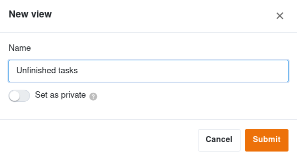

SeaTable vous permet de créer différentes vues pour vos tableaux et de visualiser les mêmes données de différentes manières. Par exemple, si vous souhaitez filtrer un tableau pour une valeur spécifique, vous pouvez enregistrer la vue filtrée du tableau et y accéder plus rapidement à l'avenir sans avoir à filtrer à nouveau.

## Pour créer une nouvelle vue dans SeaTable

1. Cliquez sur le **nom de la vue actuelle**.
2. Cliquez sur **Ajouter une vue ou un dossier** et sélectionnez le **type de vue** souhaité.

3. Donnez un **nom** à la nouvelle vue.
4. Activez le curseur si vous souhaitez que la nouvelle vue ne soit pas visible par tous, mais **privée**.
5. Confirmez en cliquant sur **Envoyer**.

La nouvelle **vue** s'ouvre automatiquement et vous pouvez par exemple **filtrer**, **trier** ou **grouper** les valeurs de votre choix dans cette vue.



Vous trouverez [ici]() des informations détaillées sur les trois outils d'évaluation que sont le **regroupement**, le **tri** et le **filtre**.



Vous avez également la possibilité de créer des vues privées. Découvrez les différences entre les vues privées et les vues normales [dans cet article]().