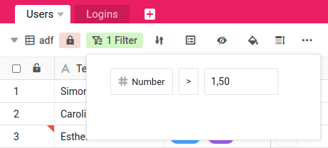

Puede **bloquear vistas** de una tabla en SeaTable. Esta función es especialmente útil cuando se trabaja en grupo. Aquí, **los usuarios con derechos de propietario o administrador** tienen la opción de bloquear una vista para todos los demás miembros del grupo que no tengan uno de estos dos niveles de permiso. Esto significa que estos miembros ya no pueden realizar cambios en las opciones de vista.

Entre otras cosas, los **filtros, la ordenación y la agrupación** de una vista se ven afectados por el bloqueo. La configuración seleccionada se mantiene hasta que un usuario con derechos de propietario o administrador elimina el bloqueo.

Tenga en cuenta, no obstante, que el bloqueo de una vista **no** suele influir en el **tratamiento de los datos**. Los datos de una vista bloqueada pueden seguir siendo **editados** por todos los miembros del grupo.

## Bloquear una vista

1. Abra la **vista** que desea bloquear.
2. Pulse sobre el **icono de bloqueo** en las opciones de vista situadas encima de la tabla.
3. El **bloqueo** de la vista correspondiente está ahora **activo** y puede cancelarse pulsando de nuevo sobre el **símbolo de bloqueo**.

## Impacto

Cuando un usuario con derechos de propietario o administrador bloquea una vista, congela la configuración actual de la vista e impide que los miembros del grupo sin estos derechos **realicen cambios en la configuración**.

En la vista bloqueada, ya **no** se pueden modificar los siguientes ajustes:

- Filtros
- Ordenaciones
- Agrupaciones
- Ocultar columnas
- Resaltar el color
- Ajuste de la altura de la fila



Tenga en cuenta que el bloqueo de una vista sólo se aplica a la configuración de la vista – las vistas bloqueadas **no** impiden que otros miembros del grupo vean y editen el contenido de la vista. El que otros miembros del grupo puedan o no editar una vista depende de su estado de autorización dentro del grupo. Para obtener más información, consulte el artículo de resumen [Los miembros del grupo y sus permisos]().



## Ejemplos de aplicación

En principio, tiene sentido recurrir al bloqueo de una vista si los cambios imprevistos y a corto plazo en la configuración de una vista pueden afectar al flujo de trabajo de su equipo.

### Ejemplos concretos en los que bloquear una vista puede ser útil:

- Ha creado una vista filtrada que necesita para una presentación a uno de sus clientes, y cambiar las condiciones del filtro a corto plazo revelaría datos confidenciales.
- Ha creado una vista para la nueva campaña de contratación de su empresa a la que pueden acceder numerosos candidatos potenciales. Si ahora cambia el aspecto de la vista, se producirían malentendidos.
- Ha creado cuidadosamente una nueva vista de calendario. Un cambio en la configuración de esta vista podría dar lugar a que se transfirieran datos no deseados al calendario.
