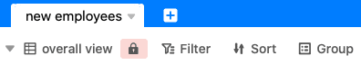
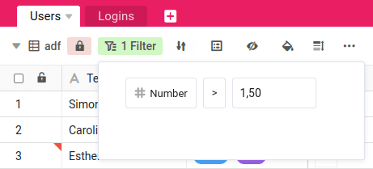

Вы можете **блокировать\*\***представления** таблицы в SeaTable. Эта функция особенно полезна при работе в группах. Здесь **пользователи с правами владельца или администратора\*\* имеют возможность заблокировать представление для всех остальных членов группы, которые не имеют ни одного из этих двух уровней прав. Это означает, что эти члены больше не могут вносить изменения в параметры просмотра.

Помимо прочего, блокировка влияет на **фильтры, сортировку и группировку** представления. Выбранная конфигурация остается на месте до тех пор, пока блокировка не будет снята пользователем с правами владельца или администратора.

Однако обратите внимание, что блокировка представления обычно **не** влияет на **обработку данных**. Данные в заблокированном представлении по-прежнему могут **редактироваться** всеми членами группы.

## Вид замка

1. Откройте **представление** любой таблицы, которую вы хотите заблокировать.
2. Нажмите на **замок в** опциях просмотра над таблицей.
3. Теперь **блокировка** соответствующего вида **активна** и может быть снята повторным нажатием на **блокировку**.

## Влияние

Когда пользователь с правами владельца или администратора блокирует представление, он замораживает текущую конфигурацию представления и предотвращает **изменение настроек** членами группы без этих прав.

В заблокированном представлении больше **нельзя** изменить следующие параметры:

- Фильтр
- Градусы
- Группировки
- Скрыть колонки
- Выделение цветом
- Регулировка высоты ряда



[Члены группы и их разрешения]()

## Примеры применения

В принципе, имеет смысл прибегнуть к блокировке представления, если краткосрочные и непредвиденные изменения в конфигурации представления могут повлиять на рабочий процесс в вашей команде.

### Конкретные примеры, когда блокирование обзора может быть полезным:

- Вы создали фильтрованное представление, которое необходимо для презентации одному из ваших клиентов, и изменение условий фильтрации в кратчайшие сроки может раскрыть конфиденциальные данные.
- Вы создали представление для новой рекрутинговой кампании вашей команды, к которому могут получить доступ многочисленные потенциальные кандидаты. Кратковременное изменение конфигурации этого представления приведет к недоразумениям.
- Вы тщательно создали новое представление, для которого впоследствии хотите установить плагин календаря. Кратковременное изменение конфигурации этого представления может привести к тому, что в календарь незаметно будут переданы неверные данные.
