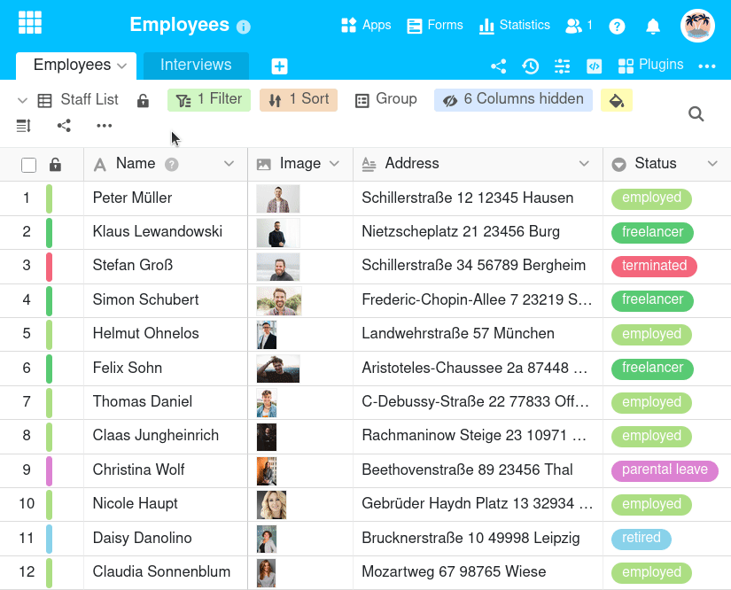
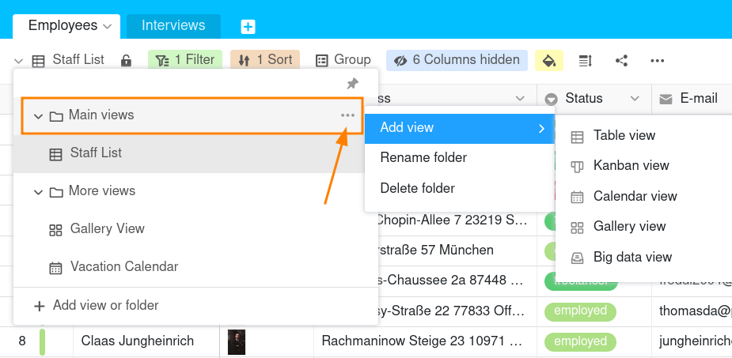

Neben der Veränderung der Reihenfolge können Sie Ihre Ansichten auch durch **Ordner** übersichtlicher strukturieren. Erstellen Sie hierzu beliebig viele Ansichtsordner und verschieben Sie Ihre Ansichten per Drag-and-Drop.

## Gruppierung von Ansichten mithilfe von Ordnern

### Einen neuen Ordner anlegen

1. Klicken Sie auf den **Namen der aktuellen Ansicht**.
2. Gehen Sie auf **Ansicht oder Ordner hinzufügen**.
3. Wählen Sie die unterste Option namens **Ordner** aus.
4. Geben Sie dem Ordner einen **Namen** und bestätigen Sie mit **Abschicken**.


Nachdem Sie **den ersten neuen Ansichtsordner** erstellt haben, liegen automatisch alle von Ihnen bereits erstellten Ansichten im Ordner **Mehr Ansichten**. Verschieben Sie die Ansichten, um Ihre eigens erstellten Ordner zu füllen.


### Ansichten in einen Ordner verschieben

1. Klicken Sie auf den **Namen der aktuellen Ansicht**.
2. Bewegen Sie den Mauszeiger auf die Ansicht, die Sie in den erstellten Ordner verschieben wollen.
3. Halten Sie die linke Maustaste auf der **Sechs-Punkte-Greiffläche** gedrückt und ziehen Sie die Ansicht in den gewünschten Ordner.

## Verwaltung der eigenen Ansichtsordner

Nachdem Sie einen eigenen Ordner erstellt haben, können Sie diesen auch **umbenennen**, **löschen** oder **neue Ansichten direkt im Ordner hinzufügen**. Fahren Sie dazu mit dem Mauszeiger über den Ordner und klicken Sie auf die **drei Punkte**.

Den System-Ordner **Mehr Ansichten** können Sie jedoch nicht bearbeiten.