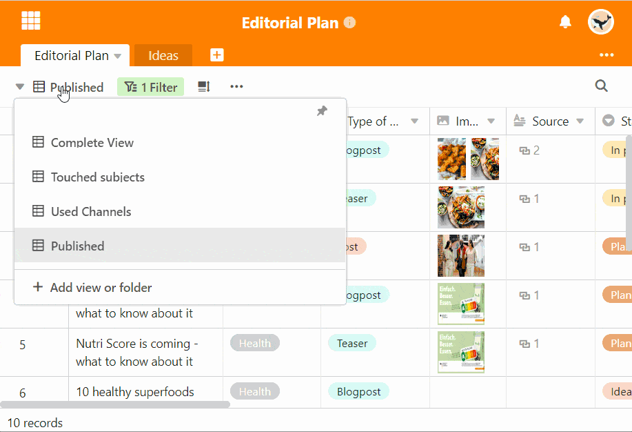

Neben der Veränderung der Reihenfolge können Sie Ihre Ansichten auch durch **Ordner** übersichtlicher anordnen. Erstellen Sie hierzu beliebig viele Ansichts-Ordner und sortieren Sie Ihre Ansichten.

## Gruppierung von Ansichten in Ordnern

1. Klicken Sie auf den **Namen der aktuellen Ansicht**.
2. Wählen Sie die unterste Option mit der Beschriftung **Ansicht oder Ordner hinzufügen** aus.
3. Wählen Sie die Option **Ordner hinzufügen** aus.
4. Benennen Sie den Ordner und bestätigen Sie mit **Abschicken**.
5. Bewegen Sie die Maus auf die Ansicht, die Sie in den erstellten Ordner verschieben wollen.
6. Halten Sie das **Sechs-Punkte-Symbol**

    
    zum Verschieben gedrückt und ziehen Sie die Ansicht in den gewünschten Ordner.

## Automatischer neuer Ordner

Nachdem Sie **den ersten neuen Ansichts-Ordner** erstellt haben, liegen automatisch alle von Ihnen bereits erstellten Ansichten im Ordner **Mehr Ansichten**. Verschieben Sie die Ansichten, um Ihre eigens erstellten Ordner zu füllen.
