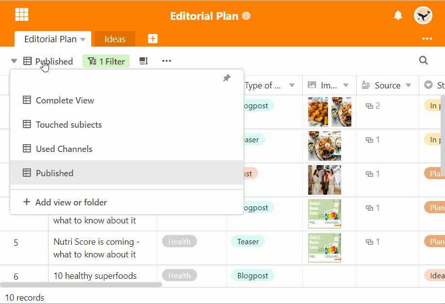

Para além de alterar a encomenda, pode também organizar as suas opiniões de forma mais clara utilizando **pastas**. Para o fazer, crie tantas pastas de visualização quantas quiser e classifique as suas opiniões.

## Agrupar pontos de vista em pastas

1. Clique sobre o **nome da vista actual**.
2. Seleccionar a opção mais baixa com o rótulo **View ou Add Folder**.
3. Seleccionar a opção **Adicionar Pasta**.
4. Nomear a pasta e confirmar com **Submeter**.
5. Mova o rato para a vista que pretende mover para a pasta criada.
6. Segure o **Símbolo de seis pontos**

    
    para mover e arrastar a vista para a pasta desejada.

## Nova pasta automática

Depois de ter criado **a primeira pasta de novas vistas**, todas as vistas que já criou estão automaticamente na pasta **Mais** Vistas. Mova as vistas para preencher as suas pastas especialmente criadas.
