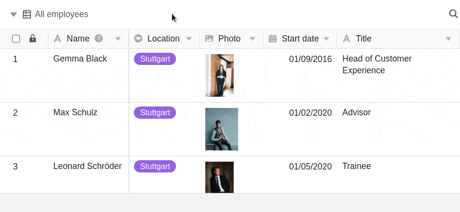

In jeder Tabelle haben Sie die Möglichkeit, alle verfügbaren [Ansichten](
) dauerhaft in einer Navigationsleiste am linken Rand einzublenden. Das ergibt vor allem Sinn, wenn Sie oft zwischen Ansichten wechseln und ein **Schnellzugriff** dies effizienter macht.

Eine angepinnte **Ansichtsnavigation** bleibt auch sichtbar, wenn Sie innerhalb einer Tabelle nach rechts scrollen. So können Sie problemlos Einträge in verschiedenen Ansichten miteinander vergleichen.

## So blenden Sie die Ansichtsnavigation ein und aus

1. Klicken Sie auf das Drop-down-Symbol  neben der aktuell geöffneten Ansicht.
2. Klicken Sie auf die Pin-Nadel .

Solange die Pin-Nadel **rot** markiert ist, sind die verfügbaren Tabellenansichten am linken Seitenrand **angepinnt**. Um die Ansichtsnavigation wieder **auszublenden**, klicken Sie erneut auf die Pin-Nadel.
