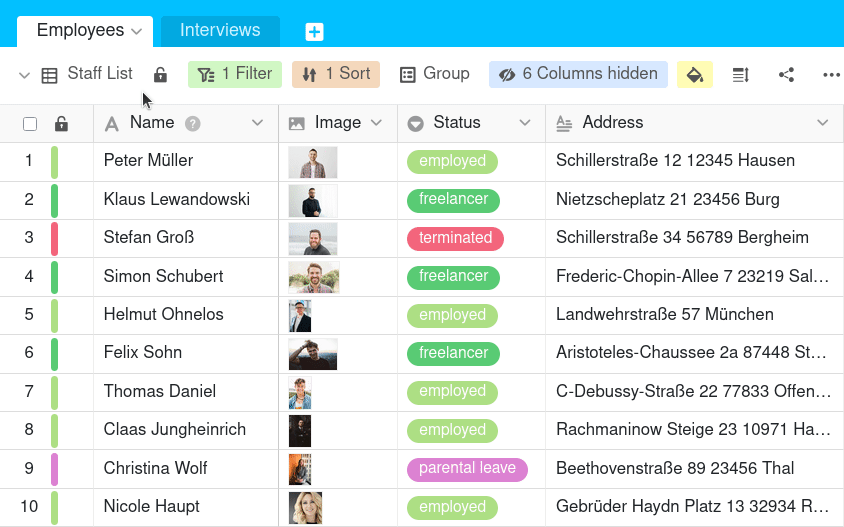

En cada tabla tiene la opción de mostrar permanentemente todas las [vistas]() disponibles en una **barra de navegación** en el margen izquierdo. Esto tiene sentido sobre todo si cambia a menudo de vista y un **acceso rápido** hace que esto sea más eficiente.

La navegación de vistas anclada permanece visible incluso si se desplaza hacia la derecha dentro de una tabla. De este modo, puede comparar fácilmente las entradas de distintas vistas.

## Para mostrar y ocultar la navegación de la vista

1. Haga clic en el **nombre de la vista actual**.
2. Haga clic en la **aguja de la chincheta**  de la esquina superior derecha.

Mientras la aguja esté marcada **en rojo**, las vistas de la tabla disponibles se **fijarán** en el margen izquierdo. Para volver a **ocultar** la navegación por las vistas, haga clic de nuevo en la aguja de la chincheta.
