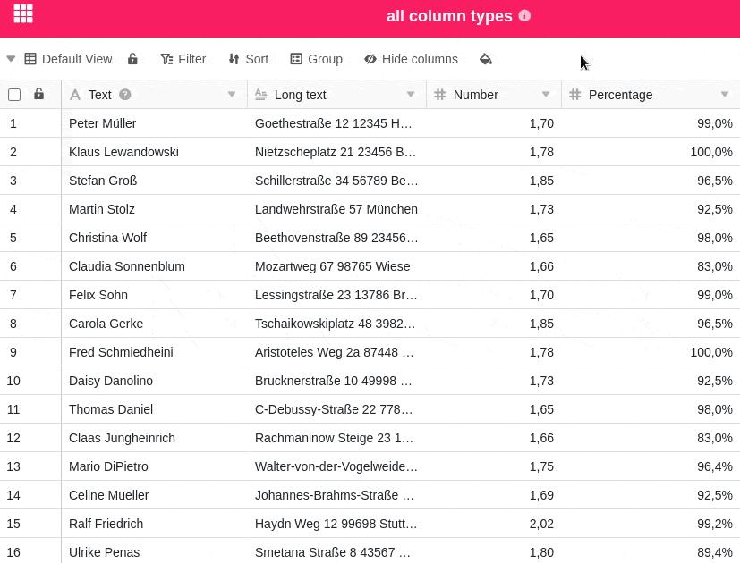

Cuantas más columnas cree para introducir datos, más confusa será su tabla. Para mantener una visión general de sus datos en todo momento, puede ocultar columnas individuales de la tabla que actualmente no sean necesarias o irrelevantes. Además, puede ajustar el orden de las columnas como desee mediante la función de arrastrar y soltar.

## Ocultar columnas

1. Haga clic en **Ocultar** en las opciones de vista de cualquier tabla.
2. Oculte cualquier número de columnas **haciendo clic** sobre ellas. Utilice el **campo de búsqueda** para limitar la selección de columnas o para buscar una columna específica que desee ocultar.



## Mover columnas

Mantenga pulsado el botón izquierdo del ratón en la **zona de agarre de seis puntos** situada delante de los nombres de las columnas y arrástrelas hacia arriba o hacia abajo en la lista para cambiar el orden de las columnas de la tabla como desee.

Además, también puede mover las columnas directamente en la **vista de tabla** mediante arrastrar y soltar. Para ello, mantenga pulsado el botón del ratón sobre el **nombre de una columna** y desplácela hacia la derecha o hacia la izquierda.



Tenga en cuenta que la **primera columna** de una tabla **no** se puede mover. Puede conocer otras características especiales de la primera columna en el [artículo de resumen]() correspondiente.


