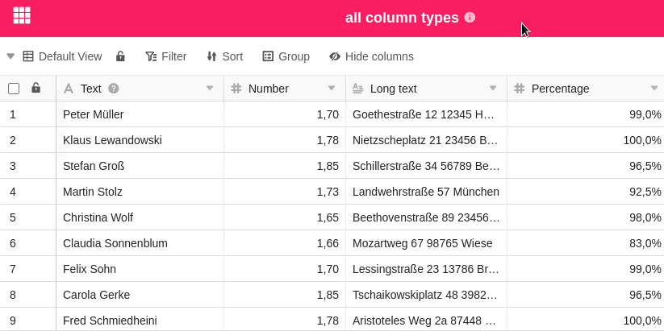
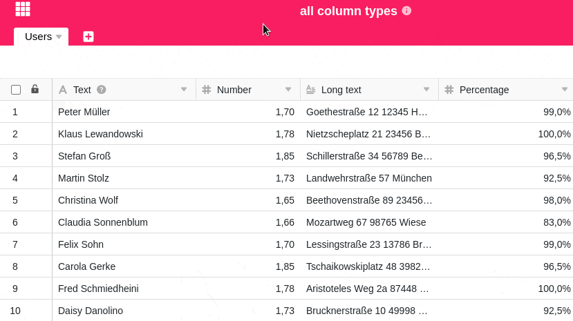

Quanto mais colunas criar para introduzir dados, mais confusa se torna a sua tabela. Para manter uma visão geral dos seus dados em qualquer altura, pode ocultar colunas individuais da tabela que não são actualmente necessárias ou irrelevantes. Além disso, pode ajustar a ordem das colunas como desejar, utilizando o arrastar e largar.

## Ocultar colunas

1. Clique em **Ocultar** nas opções de visualização de qualquer tabela.
2. Oculte qualquer número de colunas, **clicando nelas**. Utilize o **campo de pesquisa** para restringir a selecção de colunas ou para procurar uma coluna específica que deseja ocultar.



## Mover colunas

Mantenha premido o botão esquerdo do rato na **área de aperto de seis pontos** à frente dos nomes das colunas e arrastá-las para cima ou para baixo na lista para alterar a ordem das colunas na tabela, conforme desejado.

Além disso, também se pode mover as colunas directamente na **vista de tabela** usando o arrastar e largar. Para o fazer, manter premido o botão do rato sobre o **nome de uma coluna** e mover a coluna para a direita ou esquerda.



É favor notar que a **primeira coluna** de uma tabela **não pode** ser deslocada. Pode informar-se sobre outras características especiais da primeira coluna no [artigo de síntese]() correspondente.


