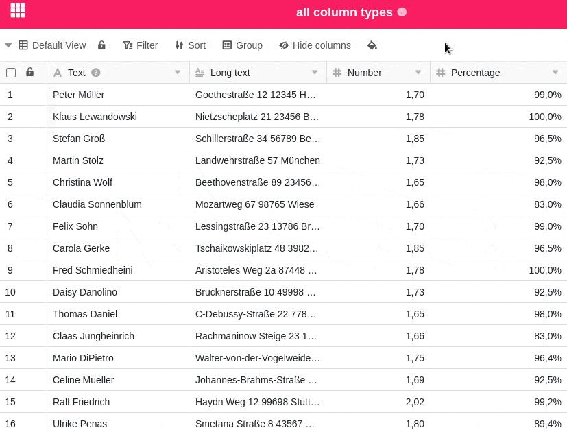
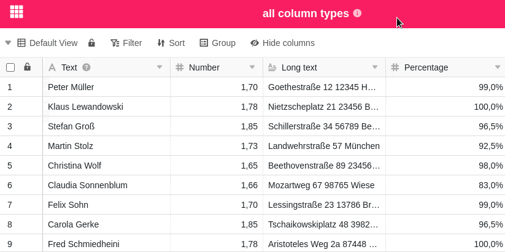
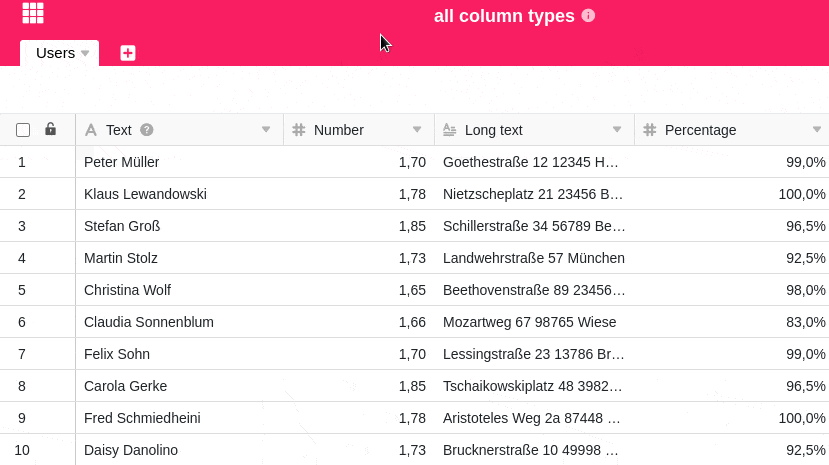

Чем больше столбцов вы создаете для ввода данных, тем более запутанной становится ваша таблица. Чтобы всегда иметь представление о своих данных, можно скрыть отдельные столбцы таблицы, которые в данный момент не нужны или неактуальны. Кроме того, вы можете настроить порядок колонок по своему усмотрению с помощью перетаскивания.

## Скрыть колонки

1. Нажмите кнопку **Скрыть** в параметрах просмотра любой таблицы.
2. Скройте любое количество столбцов, **щелкнув по** ним. Используйте **поле поиска**, чтобы сузить выбор столбцов или найти конкретный столбец, который нужно скрыть.



## Переместить колонки

Удерживайте кнопку мыши на **Символы с шестью точками**  перед названиями столбцов и перетаскивайте их вверх или вниз в списке, чтобы изменить порядок столбцов в таблице по желанию.

Кроме того, столбцы можно перемещать непосредственно в **представлении таблицы** с помощью перетаскивания. Для этого, удерживая кнопку мыши на **названии столбца**, переместите столбец вправо или влево.



Обратите внимание, что **первый столбец** таблицы **не может** быть перемещен. О других особенностях первой колонки вы можете узнать в соответствующей [обзорной статье]().


