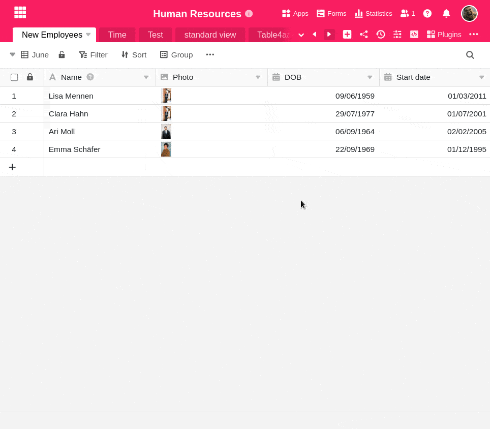

**Vistas** diferentes podem facilitar o trabalho com tabelas que contêm muita informação. Também pode **imprimir** estes pontos de vista.

## Imprimir uma vista

1. Primeiro: A vista que deseja imprimir deve ser **seleccionada de momento**.
2. Clique nos **três pontos** das opções de visualização na extrema direita.
3. Seleccionar a opção **Print View**.
4. Abre-se a janela de **definições de impressão**. Faça aqui as suas definições de impressão desejadas e clique em **Imprimir**.
5. Abre-se agora a **janela de impressão padrão do** seu equipamento, onde pode ver uma pré-visualização da impressão e efetuar outras definições,^ tais como a **impressora** a utilizar, a **cor** e o número de **cópias**.
6. Clique novamente em **Imprimir** na janela de impressão para iniciar a impressão.

## Possíveis opções de impressão

Tem a opção de definir as seguintes opções de impressão:

- Tamanho de papel
- Alinhamento
- Escala da coluna
- Tamanho de letra
- Escala
- Título
- Número de linhas a imprimir
- Envolver texto longo em várias linhas
- Mostrar apenas o resultado sem o tipo de resultado
