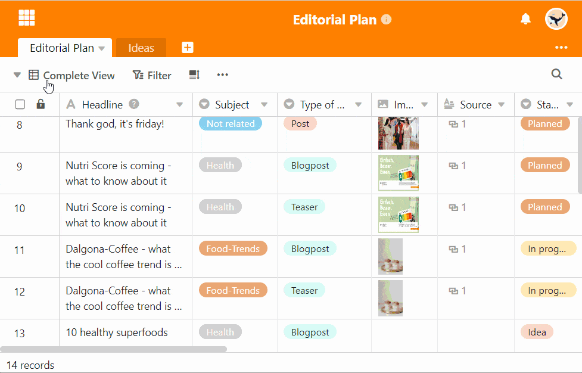

Para crear una copia exacta de una vista y aplicar todos los ajustes, puede **duplicar** la vista. A continuación, puede ajustar la configuración de la vista duplicada según sea necesario y [cambiar el nombre de](https://seatable.io/es/docs/grundlagen-von-ansichten/umbenennen-einer-ansicht/) la vista.

## Duplicar vistas

1. Haga clic en el **nombre de la vista actual**.
2. Mueva el ratón sobre la vista que desea duplicar.
3. **Tres puntos** se hacen visibles en la línea de visión. Selecciónalos.
4. Seleccione la opción **Duplicar vista**.
5. A continuación, se crea una **copia** de la vista seleccionada.

## Duplicar una vista normal existente en una vista privada

Las vistas privadas, como su nombre indica, **no** son visibles para otros usuarios. Por lo tanto, son especialmente adecuadas para la vista de tus datos personales cuando colaboras con otros usuarios en una tabla en la que la configuración de la vista[(filtros](), [columnas ocultas](https://seatable.io/es/docs/ansichtsoptionen/ausblenden-und-verschieben-von-spalten/)) cambia con frecuencia.

Para que **no** tenga que volver a configurar su vista privada en este caso, SeaTable ofrece la opción de duplicar una vista existente en una **vista privada** que **sólo** puede ser editada por usted.


