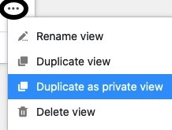

Pour créer une copie exacte d'une vue et reprendre tous les paramètres, vous pouvez **dupliquer** la vue. Vous pouvez ensuite adapter les paramètres de la vue dupliquée selon vos besoins et [renommer]() la vue.

## Dupliquer des vues

1. Cliquez sur le **nom de la vue actuelle**.
2. Passez la souris sur la vue que vous souhaitez dupliquer.
3. **Trois points** sont visibles dans la ligne d'affichage. Sélectionnez-les.
4. Sélectionnez l'option **Dupliquer la vue**.
5. Une **copie** de la vue sélectionnée est alors créée.

## Dupliquer une vue normale existante en une vue privée

Les vues privées, comme leur nom l'indique, ne sont **pas** visibles pour les autres utilisateurs. Elles sont donc particulièrement adaptées à votre affichage personnel des données si vous collaborez avec d'autres utilisateurs dans un tableau où les paramètres d'affichage[(filtres](), [colonnes masquées]() changent fréquemment.

Pour **éviter d'** avoir à reconfigurer votre vue privée dans ce cas, SeaTable offre l'option de dupliquer une vue existante en une **vue privée** qui ne peut être modifiée **que** par vous.



Les différences exactes entre les vues **normales** et les vues **privées**, vous pouvez les lire [ici]().


