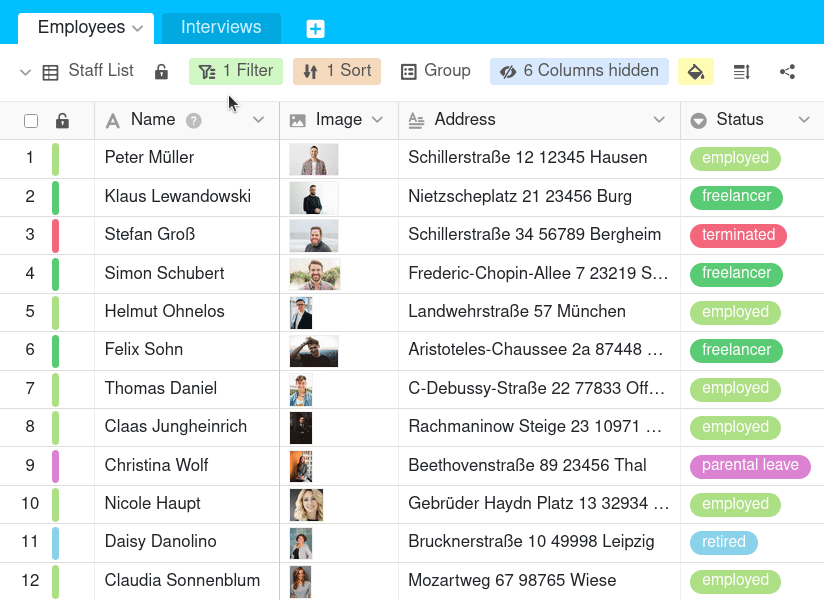

Para criar uma cópia exacta de uma vista e aplicar todas as definições, pode **duplicar** a vista. Pode então ajustar as definições da vista duplicada conforme necessário e [renomear]() a vista.

## Vistas duplicadas

1. Clique sobre o **nome da vista actual**.
2. Mova o rato sobre a vista que pretende duplicar.
3. **Três pontos** tornam-se visíveis na linha de vista. Seleccione-os.
4. Seleccione a opção **Duplicar vista**.
5. É então criada uma **cópia** da vista seleccionada.

## Duplicar uma vista normal existente para uma vista privada

As opiniões privadas, como o nome sugere, **não** são visíveis para outros utilizadores. Portanto, são particularmente adequadas para a sua visualização de dados pessoais quando colabora com outros utilizadores numa tabela onde as definições de visualização como **filtros, agrupamentos e colunas ocultas** mudam frequentemente.

Para que **não** tenha de reconfigurar a sua vista privada neste caso, SeaTable oferece a opção de duplicar uma vista existente para uma **vista privada** que **só** pode ser editada por si.



Pode ler [aqui]() sobre as diferenças exactas entre as vistas **normais** e **privadas**.


