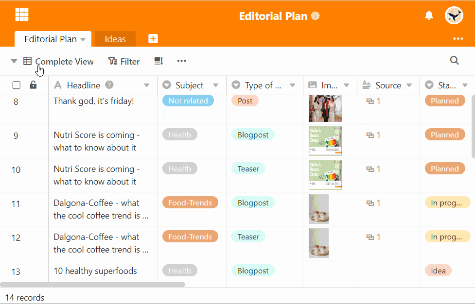
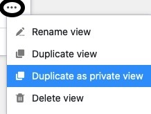

Чтобы создать точную копию вида и применить все настройки, можно **дублировать** вид. Затем можно настроить параметры дублированного представления по мере необходимости и [переименовать]() представление.

## Дублирование представлений

1. Щелкните по **названию текущего представления**.
2. Наведите курсор мыши на вид, который необходимо дублировать.
3. **Три точки** становятся видимыми на линии просмотра. Выберите их.
4. Выберите опцию **Дублировать вид**.
5. Затем создается **копия** выбранного вида.

## Дублирование существующего обычного представления в частное представление

Приватные представления, как следует из названия, **не** видны другим пользователям. Поэтому они особенно подходят для просмотра личных данных при совместной работе с другими пользователями в таблице, где настройки представления[(фильтры](), [скрытые столбцы]()) часто меняются.

Чтобы в этом случае вам **не** пришлось заново настраивать приватное представление, SeaTable предлагает возможность дублировать существующее представление в **приватное представление**, которое можете редактировать **только** вы.



О точных различиях между **обычными** и **частными** видами вы можете прочитать [здесь]().


