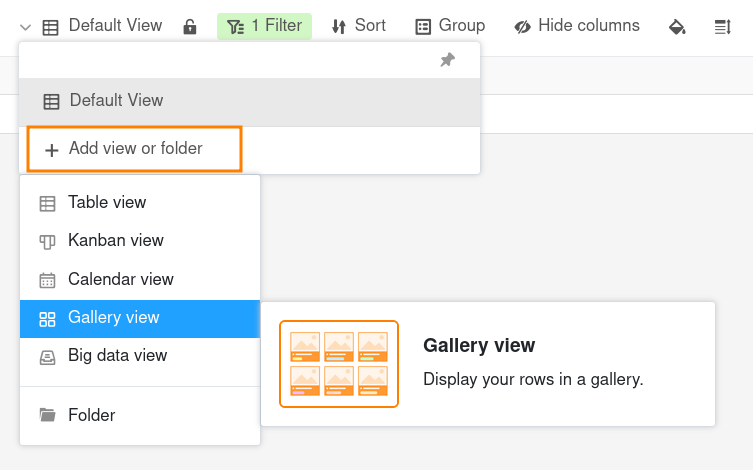
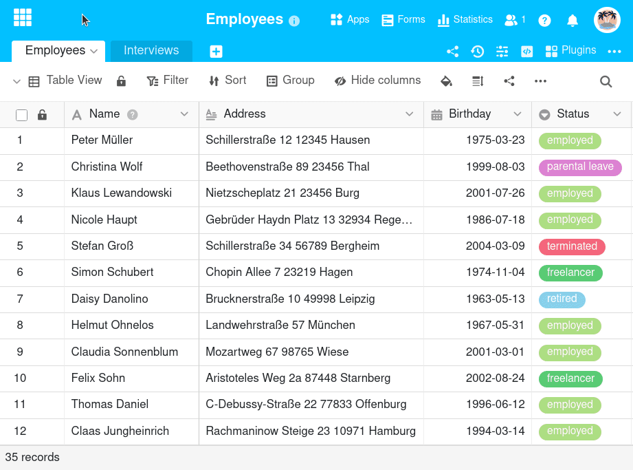
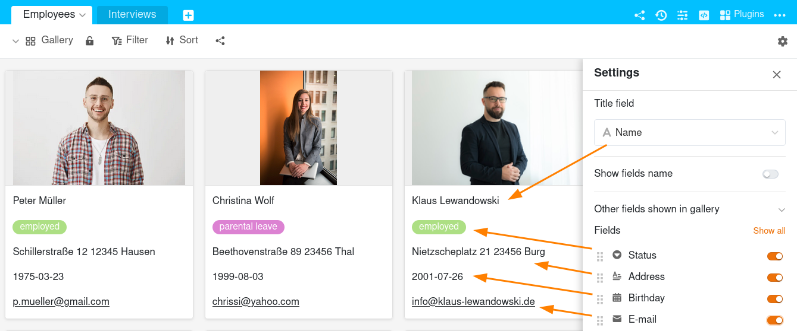
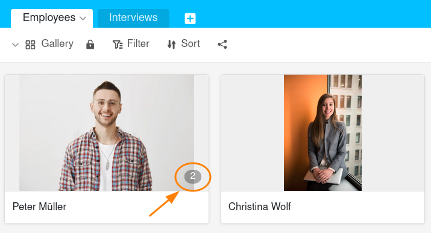
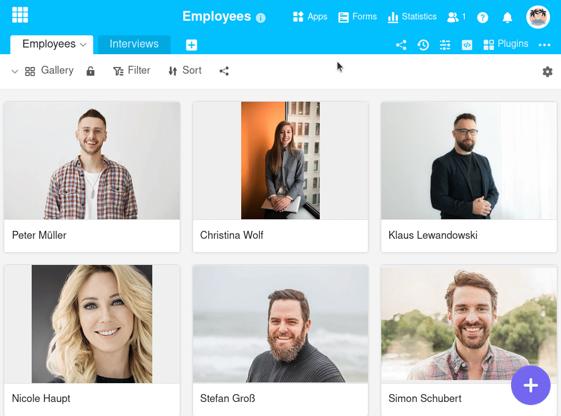
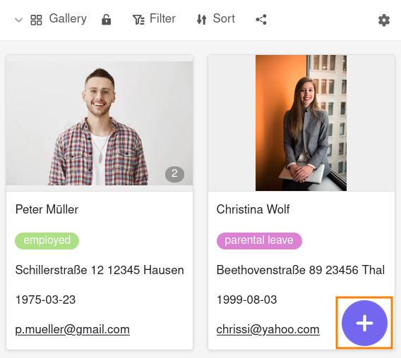
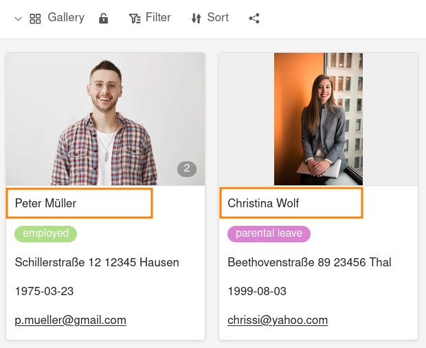

Die **Galerie-Ansicht** nutzt Vorschaubilder aus einer [Bild-Spalte](), um Datensätze übersichtlich in Kacheln anzuordnen. Dabei werden mehrere Bilder in einem **Album** zusammengefasst. Diese Darstellung eignet sich für eine Vielzahl von Anwendungsfällen, zum Beispiel [Mitarbeiterprofile](), [Produktbibliotheken](), [Inventarlisten]() oder [die Verwaltung von Sammlungen]().

## So erstellen Sie eine Galerie-Ansicht

1. Klicken Sie auf den **Namen der aktuellen Ansicht**.
2. Klicken Sie auf **Ansicht oder Ordner hinzufügen** und wählen Sie den gewünschten **Ansichtstyp** aus.

3. Geben Sie der neuen Ansicht einen **Namen**.
4. Aktivieren Sie den Regler, falls die neue Ansicht nicht für alle sichtbar, sondern **privat** sein soll.
5. Bestätigen Sie mit **Abschicken**.
6. Legen Sie daraufhin in den Einstellungen fest, aus welcher **Bild-Spalte** die Bilder stammen sollen. Die neue Ansicht generiert sich im Anschluss automatisch.
7. Geben Sie im **Titelfeld** die Spalte an, deren Einträge Sie als Albumtitel verwenden möchten.

## Ansichtsoptionen

Folgende Optionen können Sie in einer Galerie-Ansicht nutzen:
- [Ansicht sperren]()
- nach beliebigen Werten [filtern]() oder [sortieren]() 
- [Ansicht mit anderen teilen]()

## Informationen ein- und ausblenden

In den **Galerie-Einstellungen**, die Sie über das **Zahnrad-Symbol**  erreichen, können Sie durch Ein- und Ausblenden von Spalten mehr oder weniger Informationen anzeigen lassen. Aktivieren Sie die **Regler** der jeweiligen Spalten, um mehr Informationen aus den Datensätzen in der Galerie angezeigt zu bekommen.

## Mehrere Bilder in einem Album

Die **Anzahl der Bilder** pro Album wird in der Galerie mit einer **grau hinterlegten Nummer** angezeigt. Logischerweise wird die Zahl erst eingeblendet, wenn mehr als ein Bild in einem Album vorhanden ist.

Durch einen Klick auf das Vorschaubild öffnen Sie das Album im **Vollbildmodus**, in dem Sie die Bilder mithilfe der **Lupen** vergrößern und verkleinern sowie mithilfe der **Pfeile** zwischen den Bildern wechseln können.

## Einen neuen Datensatz in der Galerie-Ansicht hinzufügen

Klicken Sie auf den **lila Kreis mit dem Plus-Symbol** in der unteren rechten Ecke. Ein neues Fenster öffnet sich. Legen Sie in den **Zeilendetails** einen neuen Datensatz an und pflegen Sie die gewünschten Informationen und Bilder ein. Die Änderungen werden automatisch gespeichert, wenn Sie das Fenster schließen.

## Datensätze in der Galerie-Ansicht bearbeiten

Klicken Sie auf den **Titel** eines Albums und ein Fenster mit den **Zeilendetails** öffnet sich. Nehmen Sie die gewünschten Anpassungen am Datensatz vor. Die Änderungen werden automatisch gespeichert, wenn Sie das Fenster schließen.