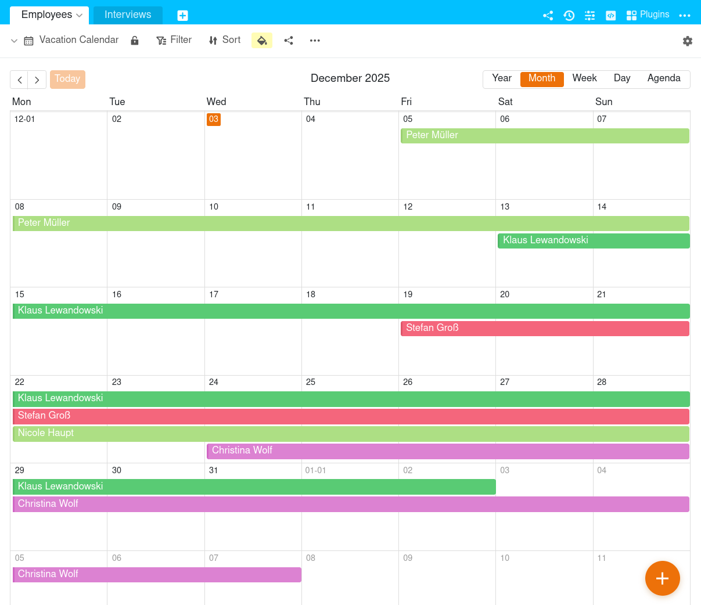
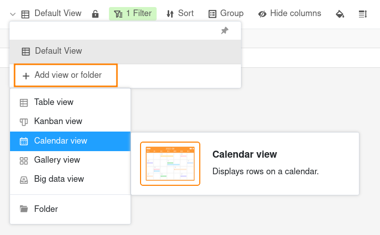
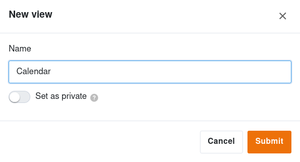
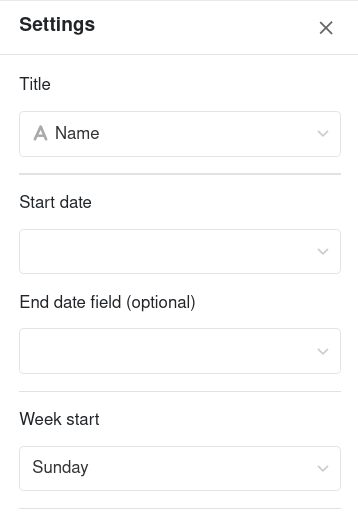
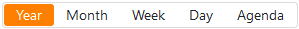
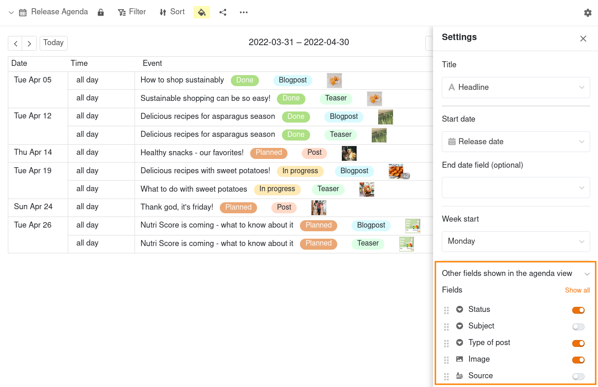
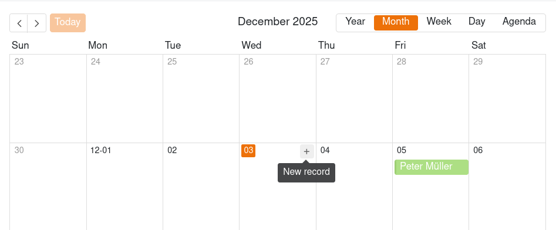

La vista de calendario le muestra los datos de una tabla en **forma de calendario**. Puede obtener una visión general de **diferentes periodos de tiempo (año, mes, semana, día)** o mostrar las citas como **agenda** en forma de lista.

Un ejemplo es la vista general mensual en un calendario de vacaciones:



Para poder utilizar la vista de calendario de forma sensata, necesita al menos una [columna de fecha]() en su tabla.



## Para crear una vista de calendario

1. Haga clic en el **nombre de la vista actual**.
2. Haga clic en **Añadir vista o carpeta** y seleccione el **tipo de vista** deseado.

3. Asigne un **nombre** a la nueva vista.
4. Active el control deslizante si la nueva vista no debe ser visible para todos sino **privada**.
5. Confirme con **Submitir**.

6. En el campo **Título**, introduzca la columna con la que desea etiquetar las entradas del calendario.
7. Especifique qué columna de fecha debe utilizarse para la **Fecha de inicio**. A continuación, la vista del calendario se genera automáticamente.
8. Opcionalmente, puede especificar una columna de fecha o duración para la **Fecha de finalización**, que define el periodo de las entradas del calendario.
9. Por último, seleccione qué día de la semana debe utilizarse como **primer día de la semana**.

Si desea cambiar algo más adelante, haga clic en el **icono de la rueda dentada**  de la esquina superior derecha y ajuste la **configuración**.

## Opciones de vista

Puede utilizar las siguientes opciones en una vista de calendario:
- [Bloquear vista]()
- [Filtrar]() u [ordenar]() por cualquier valor
- [Color de las líneas]()
- [Compartir vista con otros]()
- [Imprimir vista]()

## Las opciones de visualización en detalle

Hay un total de 5 opciones de visualización: Puede visualizar las citas en una vista general **anual**, **mensual** o **semanal**, en la **planificadora diaria** o como **agenda** en forma de lista.

Puede cambiar fácilmente entre las cinco opciones de visualización de la vista de calendario. Sólo tiene que pulsar la opción correspondiente en el **botón** situado encima del calendario.

### Vista general del año

Aquí puede ver el **año** de un vistazo. El **punto** bajo una fecha le indica que hay una entrada para ese día. También tiene la opción de pulsar sobre la fecha para llamar a los **detalles de la línea**.

### Vista general mensual

En esta vista, tiene una visión general de todos los días de un **mes**. También puede consultar aquí los **detalles de la línea** pulsando sobre una de las entradas del calendario.

### Vista general semanal

Esta visualización le muestra las **horas** en el eje vertical y los siete días de una **semana** de izquierda a derecha. También puede abrir aquí los **detalles de la línea** pulsando sobre una de las fechas.

### Planificador diario

La agenda diaria es especialmente adecuada si desea tener varias citas de un **día** en la pantalla. Al igual que el resumen semanal, le muestra las **horas** en el eje vertical. También puede abrir aquí los **detalles de la línea** pulsando sobre una de ellas.

### Visualización de la agenda

La **Agenda** enumera todas las citas de un **mes** y le ofrece la opción de ver cierta **información** sobre las citas de un vistazo.

Para ello, basta con mostrar las **columnas** deseadas de la tabla en los **ajustes** de la vista de la agenda – por ejemplo, tema, estado y tipo de publicación.

## Añadir un nuevo registro de datos en la vista de calendario

Para añadir **nuevas entradas** en la vista de calendario, tiene varias opciones.

### 1. A través del símbolo más

Haga clic en el **círculo naranja con el símbolo más** de la esquina inferior derecha. Se abrirá una nueva ventana. Cree un nuevo registro de datos en **detalles de la línea** e introduzca los datos deseados. Los cambios se guardarán automáticamente cuando cierre la ventana.



### 2. A través de un campo del calendario

Mueva el puntero del ratón sobre un **campo** del calendario y haga clic en el **símbolo más** que aparece en la esquina superior derecha. Cree un nuevo registro de datos en los **detalles de la línea** e introduzca los datos deseados. Los cambios se guardan automáticamente al cerrar la ventana.



### 3. Doble clic

Si hace **doble clic** en una posición del calendario, se abrirán también los **detalles de la línea**. De lo contrario, cree la entrada del mismo modo que con las otras opciones.



### 4. Desplegar fechas

Para esta función, necesita **dos columnas de fechas** que puedan registrar **horas**.

1. Cree dos columnas de fecha para la **hora inicial y final** y active la opción **precisa al minuto** en cada caso.
2. Abra la **vista Calendario** y seleccione la **vista semanal o diaria**.
3. En los **Ajustes** (accesibles a través del icono de rueda dentada ), seleccione las dos columnas de fecha para el calendario.
4. En el calendario, haga clic en la hora a la que debe comenzar la cita, mantenga pulsado el **botón izquierdo del ratón** y arrastre el recuadro hasta la hora a la que debe finalizar la cita.



## Mover citas mediante arrastrar y soltar

Puede mover fácilmente las entradas de la vista de calendario **mediante arrastrar y soltar**. Esto cambia automáticamente los valores correspondientes en las columnas de fechas de su tabla. Esta función está disponible para la vista **mensual**, **semanal** y **diaria**.

