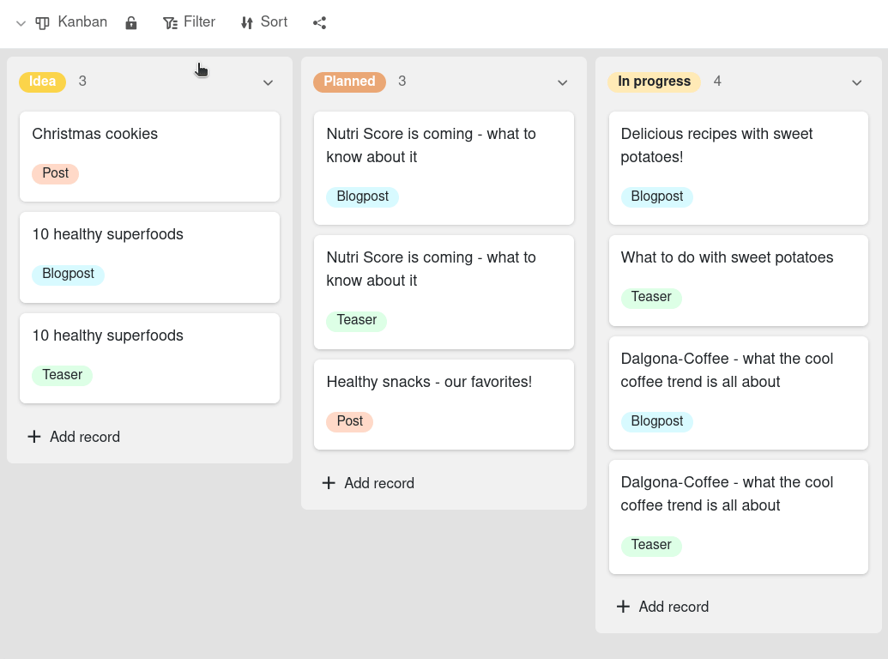
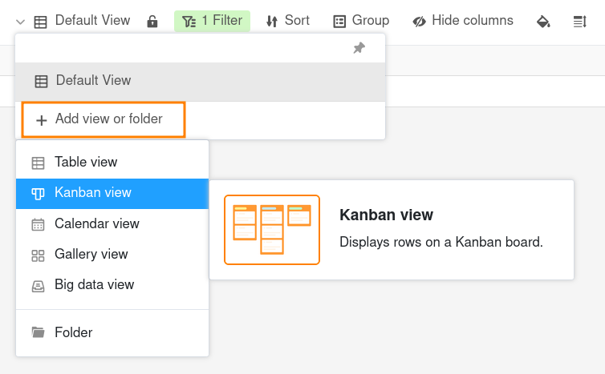
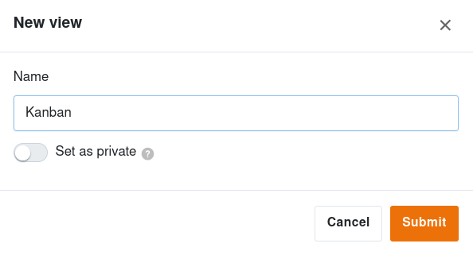
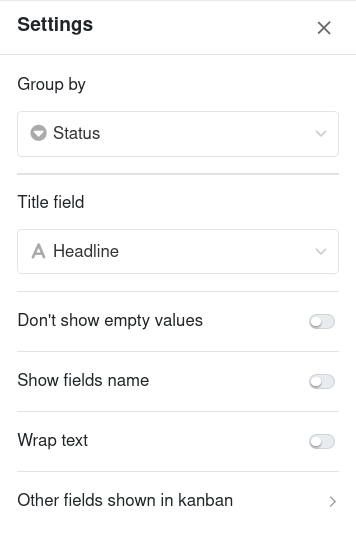
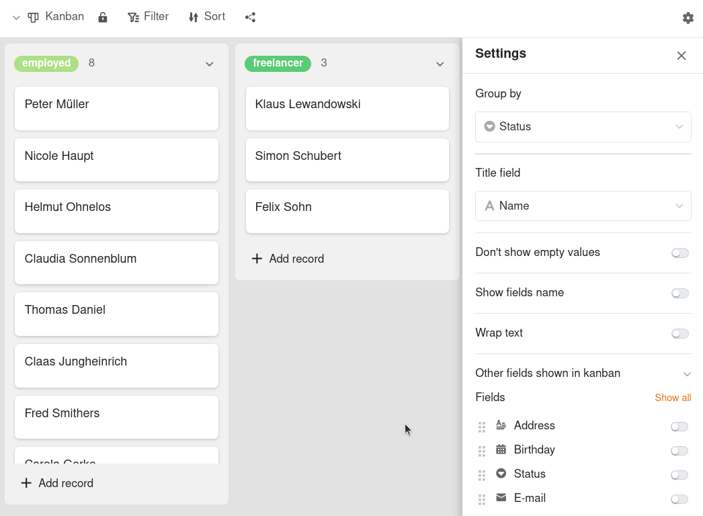
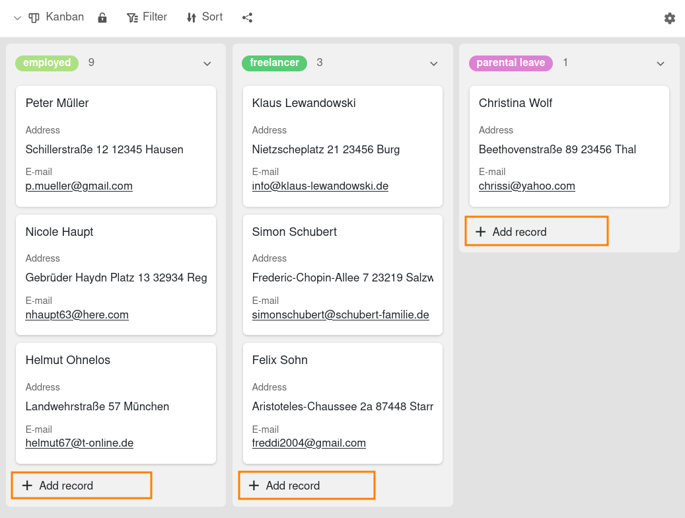

Представление **Канбан** предназначено для визуализации динамических процессов с различными фазами. В этом отношении он позволяет Вам визуализировать **рабочие процессы** и **прогресс проекта**, например. Это особенно полезно для [планирования проектов](), [разработки программного обеспечения]() или распределения задач внутри команды.



Чтобы эффективно использовать представление Kanban, Вам нужен хотя бы один столбец в Вашей таблице, позволяющий четко назначать опции. Для этого подходят типы столбцов [Одиночный выбор]() или [Сотрудники]().



## Структура представления Kanban

Представление Kanban состоит из **столбиков**, которые представляют различные этапы или фазы процесса. В рабочем процессе, например, это могут быть "идея", "запланировано", "в процессе" и "завершено".

Колонки обозначены **подвижными карточками**, которые Вы можете **перемещать** как внутри колонки, так и из одной колонки в другую. Карточка Kanban может представлять, например, пакет работ или задачу.

## Как создать представление Kanban

1. Щелкните на **Имя текущего представления**.
2. Нажмите на **Добавить вид или папку** и выберите нужный **Тип вида**.

3. Дайте новому виду **имя**.
4. Активируйте ползунок, если новое представление должно быть не видимым для всех, а **приватным**.
5. Подтвердите нажатием **Отправить**.

6. Укажите, какой столбец Вы хотите использовать для **группировки**, т.е. определение столбцов. После этого вид Kanban будет сгенерирован автоматически.
7. В поле **Заголовок** введите колонку, с помощью которой Вы хотите маркировать карточки Канбан.
8. По желанию, Вы можете активировать **контроллеры**, чтобы включить определенные функции или отобразить больше колонок.

Если Вы захотите изменить что-то позже, нажмите на **значок шестеренки**  в правом верхнем углу и настройте **настройки**.

## Настройки представления Канбан

Вы можете использовать параметры слайдера, чтобы изменить визуальное отображение вида Kanban.

- С помощью ползунка **Не показывать пустые значения** Вы можете убрать серые пустоты на карточках Kanban.
- Ползунок **Отображать названия столбцов** показывает названия столбцов над всей активированной информацией.
- Ползунок **Оборачивать текст** форматирует тексты так, чтобы они были полностью читаемы на карточках доски Kanban.

## Показывать и скрывать другие колонки

Все **колонки**, которые Вы создали в своей таблице, перечислены в нижнем разделе. Активируя отдельные **контроллеры**, записи в соответствующих колонках становятся видимыми в виде информационных заметок на карточках.



## Параметры просмотра

Вы можете использовать следующие опции в представлении Kanban:
- [Заблокировать вид]()
- [Фильтр]() или [сортировка]() по любому значению
- [Поделиться просмотром с другими]()

## Добавьте новую запись в представление Kanban

Нажмите на **Добавить строку** в нижней части столбца. Откроется новое окно. Создайте новую запись данных в **Детали строки** и введите необходимую информацию. Изменения сохраняются автоматически, когда Вы закрываете окно.

## Редактирование записей данных в представлении Kanban

Щелкните по **Канбан-карте**, и откроется окно с **Детали строки**. Внесите необходимые изменения в запись данных. Изменения сохраняются автоматически, когда Вы закрываете окно.
