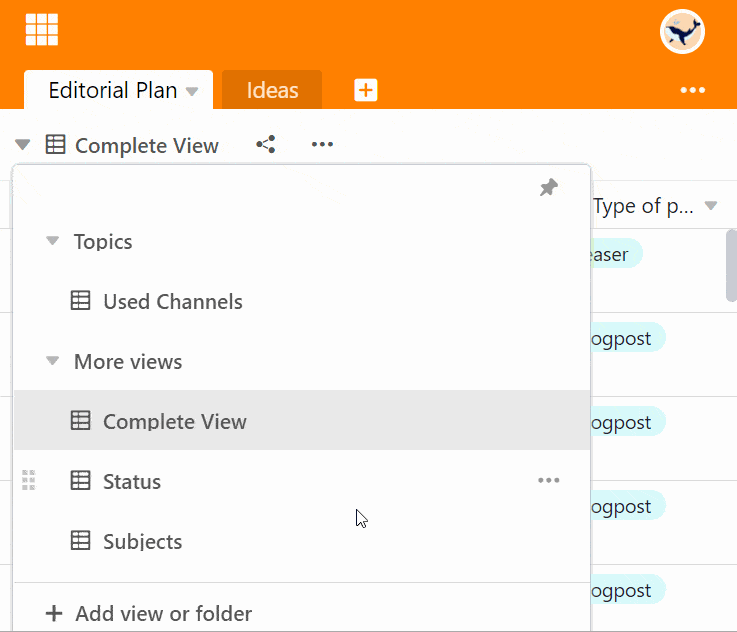

Pode alterar a **ordem** em que as suas opiniões sobre uma tabela são listadas como desejar. A mudança é feita convenientemente através do **arrastar e largar**.

## Alterar a ordem dos pontos de vista

1. Clique sobre o **nome da vista actual**.
2. Mova o rato para a vista que pretende mover.
3. Segure o aparecimento **Símbolo de seis pontos**

    
    para mover e arrastar a vista para a posição desejada. A **linha preta** mostra-lhe a posição para a qual a linha irá saltar.

4. Solte o botão do rato assim que a vista estiver na posição desejada.

## Perguntas mais frequentes

Não. A ordem das opiniões é a mesma para todos os utilizadores de uma base.

Claro que sim. As vistas podem ser facilmente organizadas em [pastas]().

Não. Pode-se mover vistas privadas da mesma forma usando o arrastar e largar. No entanto, as opiniões privadas só são visíveis para si.


