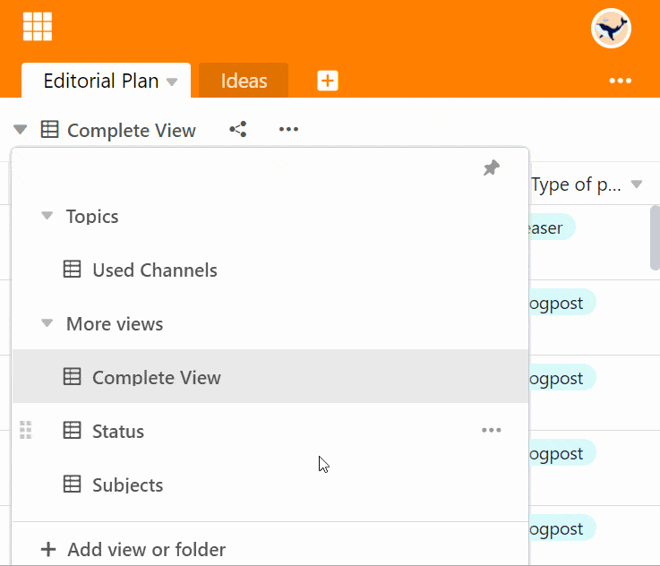

Вы можете изменить **порядок** перечисления представлений таблицы по своему усмотрению. Перемещение осуществляется удобным способом **перетаскивания**.

## Изменение порядка представления

1. Щелкните по **названию текущего представления**.
2. Подведите мышь к виду, который нужно переместить.
3. Удерживая левую кнопку мыши на **шеститочечной поверхности захвата**, переместите вид. 
4. A **чёрная линия** показывает позицию, в которую перейдет линия. Отпустите кнопку мыши, как только вид окажется в нужном положении.

## Часто задаваемые вопросы


Нет. Порядок просмотра одинаков для всех пользователей базы.


Конечно. Представления можно легко организовать в [папки]().


Нет. Вы можете перемещать частные представления таким же образом, используя перетаскивание. Однако частные виды видны только вам.

