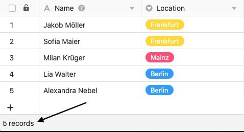

Die **Status-Zeile** befindet sich am unteren Rand Ihrer Tabellen und erfüllt grundsätzlich zwei verschiedene Funktionen, die in diesem Artikel näher erläutert werden:

- **Funktion 1**: Zählen der Zeilen in einer Ansicht
- **Funktion 2**: Angabe eines aus allen Einträgen berechneten Werts (z. B. Summe, Durchschnitt etc.) bei zahlenbasierten Spalten

Dank der Status-Zeile haben Sie diese **statistischen Basiswerte** immer im Blick, sobald Sie eine Tabelle geöffnet haben.

## Zählen der Zeilen in einer Ansicht

Die Status-Zeile gibt am unteren linken Rand die Anzahl aller **Zeilen** an, die sich in der aktuell geöffneten **Tabellenansicht** befinden. Wenn Sie [in einer Ansicht filtern](), zählt die Status-Zeile nur die verbliebenen Tabelleneinträge.

Zudem können Sie einzelne [Zeilen selektieren]() – dann bezieht sich die Status-Zeile nur auf die ausgewählten Einträge.

## Angabe eines aus allen Einträgen berechneten Werts

Bei **zahlenbasierten Spalten** gibt die Status-Zeile für jede Spalte einen aus allen Einträgen berechneten **Wert** an.

## Berechnungsoptionen

Für zahlenbasierte Spalten stehen in der Status-Zeile folgende **Berechnungsoptionen** zur Verfügung:

- Berechnung der **Summe** aus allen Einträgen der Spalte
- Berechnung des **Durchschnittswerts** aus allen Einträgen der Spalte
- Berechnung des **Medians** aus allen Einträgen der Spalte
- Ermittlung des **maximalen Werts** aus allen Einträgen der Spalte
- Ermittlung des **minimalen Werts** aus allen Einträgen der Spalte
- Keine Berechnung

## Kompatible Spaltentypen und Formate

Bei den folgenden Spaltentypen gibt die Status-Zeile einen berechneten Wert wieder:

- [Zahlen-Spalten]()
    - Zahl
    - Prozent
    - Währung
- [Dauer-Spalten]()
- [Rating-Spalten]()
- Zahlenwerte in [Formel-Spalten]()

Bei den folgenden Spaltentypen gibt die Status-Zeile **keinen** berechneten Wert wieder, obwohl sie Zahlen enthalten (können):

- [Datum-Spalten]()
- [Erstellt](die-spalten-letzter-bearbeiter-und-zuletzt-bearbeitet/)
- [Automatische Nummer]()
- Zahlen in [Text-Spalten]()
