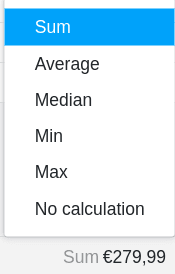

The **status-row** is located at the bottom of your tables and basically fulfills two different functions, which are explained in more detail in this article:

- **Function 1**: Counting the rows in a view
- **Function 2**: Specify a value calculated from all entries (e.g. sum, average, etc.) for number-based columns.

Thanks to the status-row you always have these **statistical basic values** in view as soon as you have opened a table.

## Counting the rows in a view

The status-row indicates at the lower left margin the number of all **rows** that are in the currently opened **table view**. If you [filter in a view](https://seatable.io/en/docs/ansichtsoptionen/filtern-von-eintraegen-in-einer-ansicht/), the status-row counts only the remaining table entries.

In addition, you can [select]()row refers only to the selected entries.

## Specification of a value calculated from all entries

For **number-based columns**, the status-row for each column gives a **value** calculated from all entries.

## Calculation options

For number-based columns, the following **calculation options** are available in the status-row :

- Calculation of the **sum of** all entries of the column
- Calculation of the **average value** from all entries of the column
- Calculation of the **median** from all entries of the column
- Determination of the **maximum value** from all entries of the column
- Determination of the **minimum value** from all entries of the column
- No calculation

## Compatible column types and formats

For the following column types, the statusrow reflects a calculated value:

- [Number columns](https://seatable.io/en/docs/text-und-zahlen/die-zahlen-spalte/)
    - Number
    - Percent
    - Currency
- [Permanent columns](https://seatable.io/en/docs/datum-dauer-und-personen/die-dauer-spalte/)
- [Rating columns](https://seatable.io/en/docs/auswahlspalten/die-rating-spalte/)
- Numerical values in [formula columns](https://seatable.io/en/docs/formeln/grundlagen-von-seatable-formeln/)

For the following column types, the status-row **does not** reflect a calculated value, although they (may) contain numbers:

- [Date columns](https://seatable.io/en/docs/datum-dauer-und-personen/die-datum-spalte/)
- [Created](https://seatable.io/en/docs/datum-dauer-und-personen/die-spalten-ersteller-und-erstellt/) and [Last Edited](https://seatable.io/en/docs/datum-dauer-und-personen/die-spalten-letzter-bearbeiter-und-zuletzt-bearbeitet/)
- [Automatic number](https://seatable.io/en/docs/text-und-zahlen/der-spaltentyp-automatische-nummer/)
- Numbers in [text columns](https://seatable.io/en/docs/text-und-zahlen/die-spalten-text-und-formatierter-text/)
