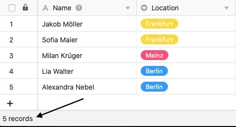
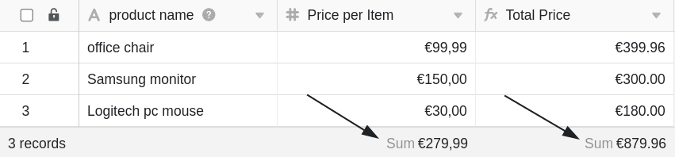
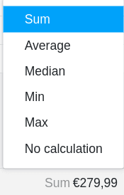

A **linha de estado** está localizada na parte inferior das suas tabelas e cumpre basicamente duas funções diferentes, que são explicadas com mais detalhe neste artigo:

- **Função 1**: contar as filas numa vista
- **Função 2**: Indicação de um valor calculado a partir de todas as entradas (por exemplo, soma, média, etc.) no caso de colunas baseadas em números.

Graças à linha de estado, tem sempre em vista estes **valores estatísticos básicos** assim que abre uma tabela.

## Contando as filas numa vista

A linha de estado indica na margem inferior esquerda o número de todas as **filas** que estão na **vista da tabela** actualmente aberta. Se [filtrar numa vista](), a linha de estado conta apenas as restantes entradas da tabela.

Além disso, pode [seleccionar linhas]() individuais - depois a linha de estado refere-se apenas às entradas seleccionadas.

## Indicação de um valor calculado a partir de todas as entradas

Para **colunas baseadas em números**, a linha de estado para cada coluna dá um **valor** calculado a partir de todas as entradas.

## Opções de cálculo

Para colunas baseadas em números, estão disponíveis as seguintes **opções de cálculo** na linha de estado:

- Cálculo da **soma** de todas as entradas da coluna
- Cálculo do **valor médio** a partir de todas as entradas da coluna
- Cálculo da **mediana** a partir de todas as entradas da coluna
- Determinação do **valor máximo** a partir de todas as entradas da coluna
- Determinação do **valor mínimo** a partir de todas as entradas da coluna
- Nenhum cálculo

## Tipos e formatos de colunas compatíveis

Para os seguintes tipos de colunas, a linha de estado reflecte um valor calculado:

- [Colunas numéricas]()
    - Número
    - Porcentagem
    - Moeda
- [Colunas permanentes]()
- [Colunas de classificação]()
- Valores numéricos em [colunas de fórmula]()

Para os seguintes tipos de colunas, a linha de estado **não** reflecte um valor calculado, embora (possam) conter números:

- [Colunas de datas]()
- [Criado]()
- [Número automático]()
- Números em [colunas de texto]()
