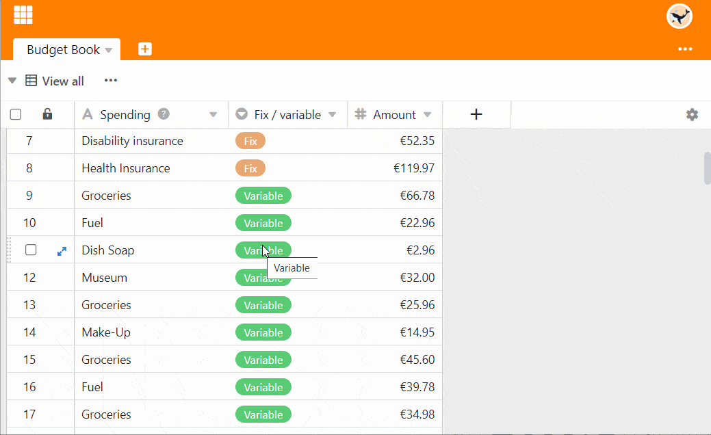
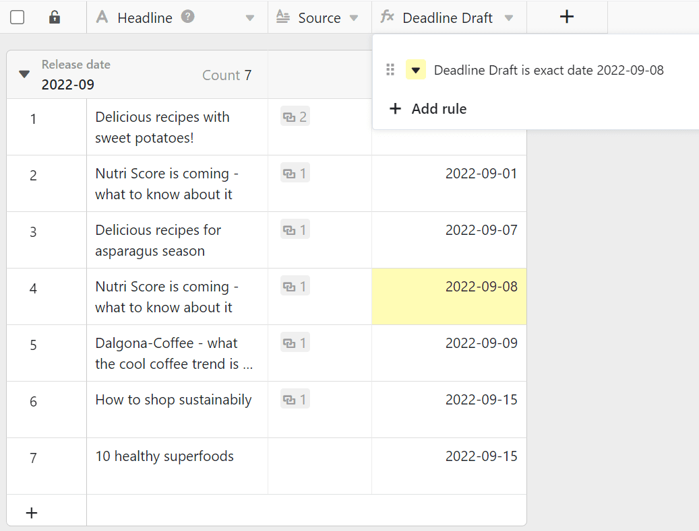

Im Gegensatz zu Excel können Sie Zellen in SeaTable nicht einfach beliebig einfärben, sondern müssen sie entweder durch von Ihnen festgelegte **Regeln** oder auf Basis der **Werte** in einer **Spalte** einfärben. Hört sich kompliziert an? Ist es aber nicht.



Neben der Option **Zellen einfärben** gibt es auch die Möglichkeit, [Zeilen farbig zu markieren](). Hierbei werden jedoch nicht die Zellen eingefärbt, sondern farbliche Markierungen am Anfang der Zeilen gesetzt.



## Einfärben durch Regeln oder nach Werten

Jede Spalte bietet die Option **Zellen der Spalte formatieren** an: 

Je nachdem, bei welchem **Spaltentyp** Sie diese Option aufrufen, wird sich SeaTable anders verhalten. Bei [Zahlen-Spalten](https://seatable.io/docs/text-und-zahlen/die-zahlen-spalte/) können Sie sowohl Regeln als auch Werte zum Einfärben verwenden. Bei allen anderen Spaltentypen stehen Ihnen nur die Regeln zum Einfärben zur Verfügung.

## So färben Sie Zellen durch eine Regel ein

1. Klicken Sie auf das **Dreieck-Symbol** im Tabellenkopf einer Spalte.
2. Wählen Sie die Option **Zellen der Spalte formatieren**.
3. Gehen Sie auf **Regeln verwenden**.
4. Klicken Sie auf **Regel hinzufügen**.
5. Klicken Sie die neu erschienene Zeile an, um die Regel zu definieren.
6. Wählen Sie eine **Spalte** aus und entscheiden Sie sich im mittleren Feld für eine **Bedingung**.
7. Geben Sie den **Wert** ein, an den die Bedingung geknüpft ist.
8. Klicken Sie auf das **farbig hinterlegte Dreieck-Symbol** vor der Regel, um den Farbwähler zu öffnen und die Farbe der Zellen zu ändern, auf die Ihre Regel zutrifft.

Durch eine Regel färben Sie **alle Zellen** in einer Spalte ein, auf die eine Regel **zutrifft**. Eine solche Regel könnte z. B. lauten: „Färbe alle Zellen mit einem Rating von drei oder mehr Sternen gelb ein.“

Sie können pro Spalte **mehrere Regeln mit unterschiedlichen Farben** anlegen.

Darüber hinaus können Sie pro Regel **mehrere Bedingungen** definieren, die sich auf alle Spalten der Tabelle beziehen können. Färben Sie beispielsweise die [Text-Spalte](https://seatable.io/docs/text-und-zahlen/die-spalten-text-und-formatierter-text/) mit der Headline eines Artikels ein, wenn der **Status** nicht “fertig” ist, das **Veröffentlichungsdatum** in der Zukunft liegt und bereits ein **Bild** vorhanden ist.



## So färben Sie Zellen durch Werte ein

1. Klicken Sie auf das **Dreieck-Symbol** im Tabellenkopf einer Spalte.
2. Wählen Sie die Option **Zellen der Spalte formatieren**.
3. Gehen Sie auf **Werte verwenden**.
4. Klicken Sie auf die **Farbauswahl**, um aus weiteren Farben wählen zu können
5. Entscheiden Sie, ab welchem und bis zu welchem **Wert** Sie die Zellen formatieren wollen.
6. Klicken Sie auf **Abschicken**.

Mit der Option **Werte verwenden** färben Sie die gesamte Spalte ein. Je größer ein Wert im gesamten Spektrum ist, desto dunkler oder heller ist die Farbe der Zelle.

Diese Art des Einfärbens hilft Ihnen dabei, schnell und einfach **Ausreißer** (also besonders kleine oder besonders große Werte) in einer Spalte sichtbar zu machen.

## Duplikate ausfindig machen

1. Klicken Sie auf das **Dreieck-Symbol** im Tabellenkopf einer Spalte.
2. Wählen Sie die Option **Zellen der Spalte formatieren**.
3. Gehen Sie auf **Duplikate hervorheben**.

Mithilfe der Option **Duplikate hervorheben** lassen sich gleiche Werte in einer Spalte schnell finden.

## Häufige Fragen



Alle Zellen mit der gleichen Farbe füllen

|||

Definieren Sie dazu eine Regel, die auf alle gewünschten Zellen zutrifft. Zum Beispiel können Sie alle **gefüllten** Zellen einer Spalte einfärben, indem Sie die Bedingung **ist nicht leer** auswählen.

---

Kurz bevorstehende Termine einfärben

|||

Sie haben hier zwei Möglichkeiten, die jeweiligen Zellen einer Datumsspalte einzufärben. Entweder Sie wählen die Bedingung **ist am oder nach** und ein **exaktes Datum** aus – oder Sie wählen die Option **ist innerhalb** und einen Zeitraum in der Zukunft aus.

---

Einen bestimmten Termin einfärben

|||

Wählen Sie die Option **ist gleich** aus und geben Sie das jeweilige Datum an.


