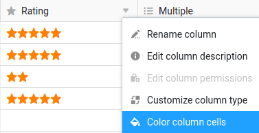
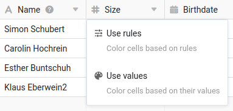
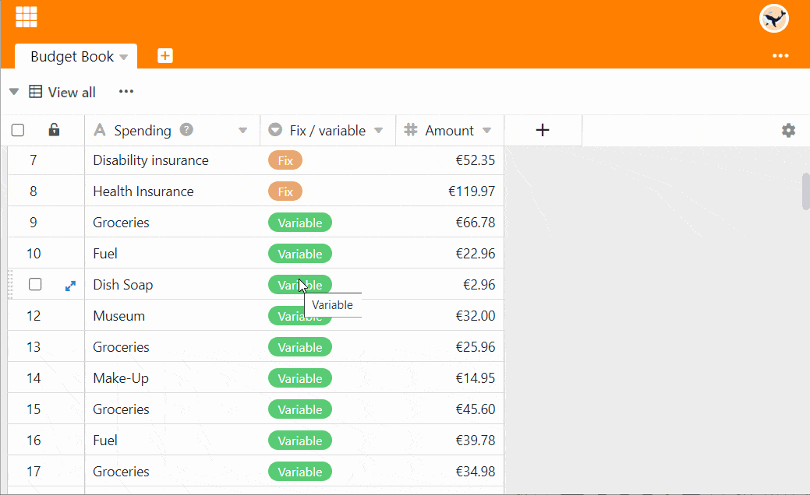
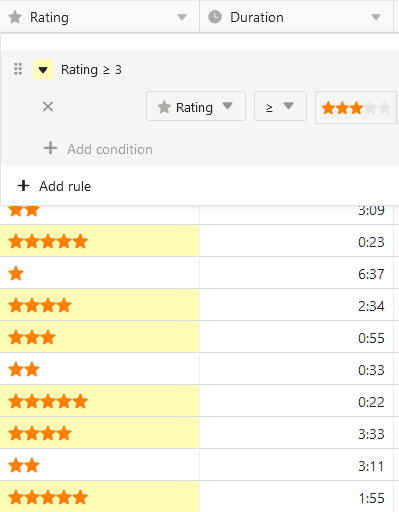
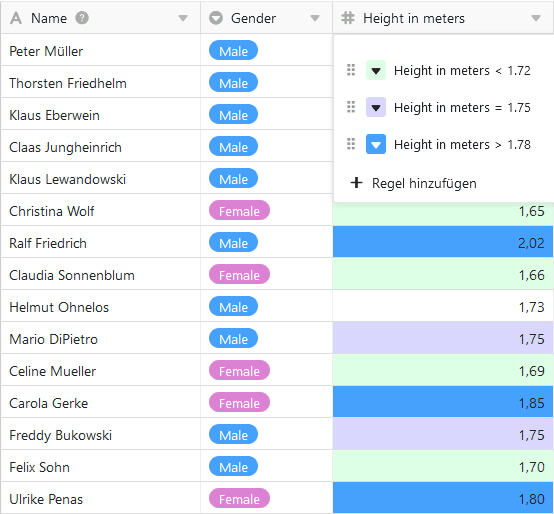
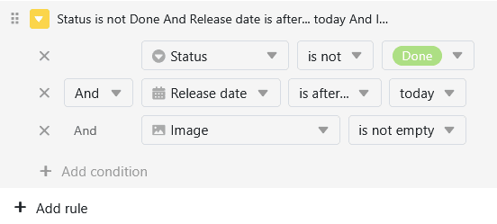
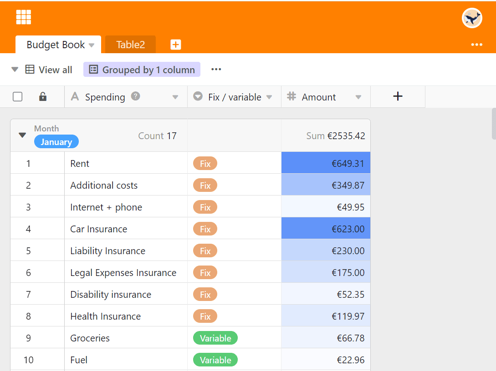
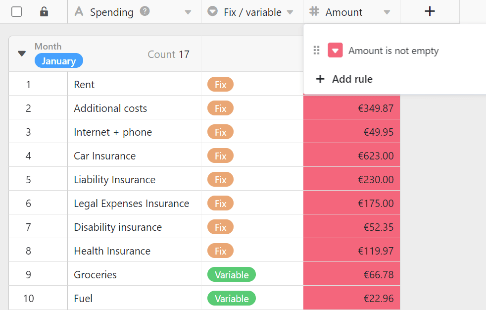
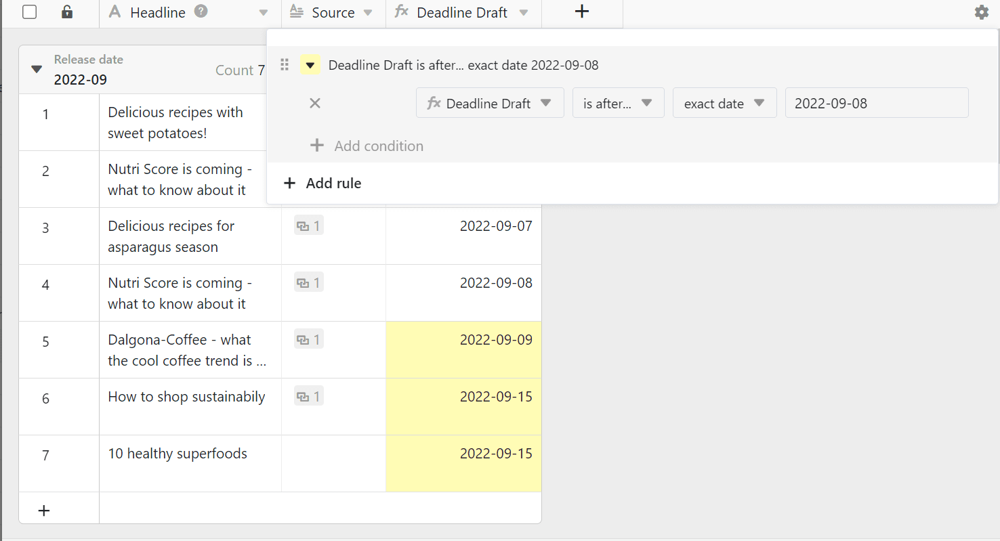
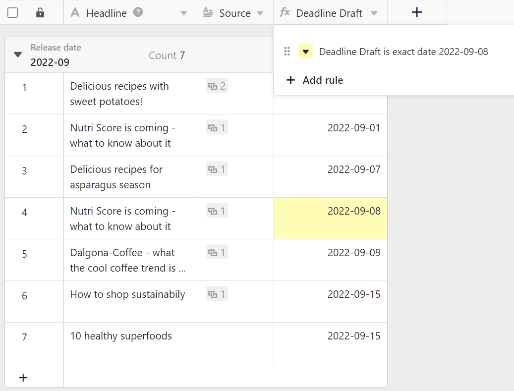

Unlike Excel, you can't just color cells arbitrarily in SeaTable, you have to color them either by **rules** you set or based on the **values** in a **column**. Sounds complicated? But it isn't.



In addition to the **Color cells** option, there is also the possibility to [markrows]() in color. In this case, however, the cells are not colored, but colored marks are set at the beginning of the rows.



## Coloring by rules or by values

Each column offers the option **Format cells of the column** an:  

SeaTable will behave differently depending on the **column type** for which you call this option. For [number columns](), you can use both rules and values for coloring. For all other column types, only the rules for coloring are available.

## To color cells by a rule

1. Click the **triangle icon** in the table header of a column.
2. Select the **Format cells of the column** option.
3. Go to **Use rules**.
4. Click **Add Rule**.
5. Click on the newly appeared row to define the rule.
6. Select a **column** and decide on a **condition** in the middle field.
7. Enter the **value** to which the condition is attached.
8. Click the **colored triangle icon** in front of the rule to open the color picker and change the color of the cells to which your rule applies.

By a rule you color **all cells** in a column to which a rule **applies**. For example, such a rule could be: "Color all cells with a rating of three or more stars yellow."

You can create **several rules with different colors** per column.

You can also define **several conditions** per rule, which can apply to all columns in the table. For example, color the [text column]() with the headline of an article if the **status** is not "finished", the **publication date** is in the future and an **image** is already available.



## To color cells by values

1. Click the **triangle icon** in the table header of a column.
2. Select the **Format cells of the column** option.
3. Go to **Use values**.
4. Click on the **color selector** to choose from more colors
5. Decide from which and up to which **value** you want to format the cells.
6. Click **Submit**.

**Use values** option colors the entire column. The larger a value is in the entire spectrum, the darker or lighter the color of the cell.

This type of coloring helps you to quickly and easily make **outliers** (i.e. particularly small or particularly large values) visible in a column.

## Locate duplicates

1. Click the **triangle icon** in the table header of a column.
2. Select the **Format cells of the column** option.
3. Go to **Highlight Duplicates**.

Using the **Highlight Duplicates** option, you can quickly find identical values in a column.

## Frequently asked questions

### Fill all cells with the same color

To do this, define a rule that applies to all the desired cells. For example, you can color all **filled** cells of a column by selecting the condition **is not empty.**

### Colorize upcoming appointments

Here you have two options to color the respective cells of a date column. Either you select the condition **is on or after** and an **exact date** - or you select the option **is within** and a period in the future.

### Color a specific date

Select the option **is equal to** and specify the respective date.

