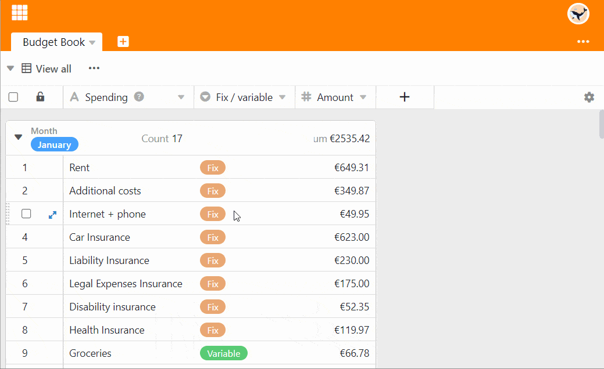

A diferencia de Excel, en SeaTable no puede simplemente colorear las celdas a su gusto, sino que debe colorearlas según las **reglas** que establezca o en función de los **valores** de una **columna**. ¿Suena complicado? Pero no lo es.



Además de la opción de **colorear las celdas**, también existe la posibilidad de colorear [las filas](). En este caso, sin embargo, las celdas no se colorean, sino que se colocan marcas de color al principio de las filas.



## Colorear por reglas o por valores

Cada columna ofrece la posibilidad de **Formatear las celdas de la columna** an:  

SeaTable se comportará de forma diferente dependiendo del **tipo de columna** para la que llame a esta opción. Para [columnas numéricas](), puede utilizar tanto reglas como valores para colorear. Para todos los demás tipos de columnas, sólo están disponibles las reglas para colorear.

## Para colorear las celdas según una regla

1. Haga clic en el **símbolo del triángulo** en la cabecera de la tabla de una columna.
2. Seleccione la opción **Formatear celdas de la** columna.
3. Ir a **Reglas de uso**.
4. Haga clic en **Añadir Regla**.
5. Haga clic en la nueva línea que aparece para definir la regla.
6. Seleccione una **columna** y decida una **condición** en el campo central.
7. Introduzca el **valor** al que se asocia la condición.
8. Haga clic en el **icono del triángulo de color** situado delante de la regla para abrir el selector de color y cambiar el color de las celdas a las que se aplica su regla.

Al utilizar una regla, se colorean **todas las celdas** de una columna a las que **se aplica** una regla. Por ejemplo, una regla de este tipo podría ser: "Colorear de amarillo todas las celdas con una valoración de tres o más estrellas".

Puede crear **varias reglas con diferentes colores** por columna.

También puede definir **varias condiciones** por regla, que pueden referirse a todas las columnas de la tabla. Por ejemplo, colorear la [columna de texto]() con el titular de un artículo si el **estado** no es "terminado", la **fecha de publicación** es futura y ya hay una **imagen** disponible.



## Para colorear las celdas por valores

1. Haga clic en el **símbolo del triángulo** en la cabecera de la tabla de una columna.
2. Seleccione la opción **Formatear celdas de la** columna.
3. Ir a **Utilizar valores**.
4. Haga clic en la **selección de** colores para elegir entre más colores
5. Decida a partir de qué **valor** y hasta qué valor desea formatear las celdas.
6. Haga clic en **Enviar**.

Con la opción **Utilizar valores** se colorea toda la columna. Cuanto mayor sea un valor en todo el espectro, más oscuro o claro será el color de la célula.

Este tipo de coloración le ayuda a hacer visibles de forma rápida y sencilla **los valores atípicos** (es decir, valores particularmente pequeños o particularmente grandes) en una columna.

## Localizar duplicados

1. Haga clic en el **símbolo del triángulo** en la cabecera de la tabla de una columna.
2. Seleccione la opción **Formatear celdas de la** columna.
3. Ir a **Resaltar duplicados**.

Con la ayuda de la opción **Resaltar duplicados**, se pueden encontrar rápidamente valores idénticos en una columna.

## Preguntas frecuentes

### Rellenar todas las celdas con el mismo color

Para ello, defina una regla que se aplique a todas las celdas deseadas. Por ejemplo, puede colorear todas las celdas **rellenas** de una columna seleccionando la condición **no está vacía**.

### Color en las próximas citas

Aquí tiene dos opciones para colorear las celdas respectivas de una columna de fecha. O bien selecciona la condición es **en o después** y una **fecha exacta** - o bien selecciona la opción **es dentro** y un periodo en el futuro.

### Colorear una fecha específica

Seleccione la opción **es igual a** e introduzca la fecha correspondiente.

