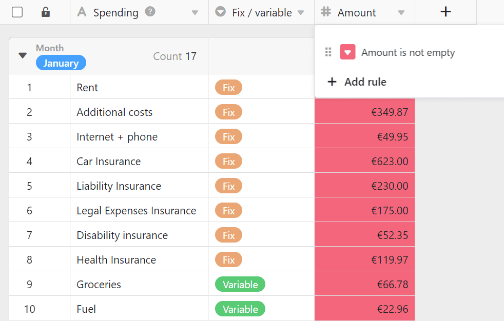

Contrairement à Excel, vous ne pouvez pas colorer les cellules de SeaTable comme bon vous semble, mais vous devez les colorer soit en fonction de **règles** que vous avez définies, soit en fonction des **valeurs** d'une **colonne**. Cela vous semble compliqué ? Mais ce n'est pas le cas.



En plus de l'option **Colorer les cellules**, il est également possible de [marquer les lignes en couleur](). Dans ce cas, ce ne sont toutefois pas les cellules qui sont colorées, mais des repères de couleur au début des lignes.



## Coloration par des règles ou selon des valeurs

Chaque colonne offre l'option **Formater les cellules de la colonne** à :  

SeaTable se comportera différemment selon le **type de colonne** pour lequel vous appelez cette option. Pour les [colonnes de chiffres](), vous pouvez utiliser à la fois les règles et les valeurs de coloration. Pour tous les autres types de colonnes, vous ne pouvez utiliser que les règles de coloration.

## Pour colorer des cellules à l'aide d'une règle, procédez comme suit

1. Cliquez sur l'**icône** en **forme de triangle** dans l'en-tête du tableau d'une colonne.
2. Sélectionnez l'option **Formater les cellules de la colonne**.
3. Allez sur **Utiliser les règles**.
4. Cliquez sur **Ajouter une règle**.
5. Cliquez sur la nouvelle ligne qui apparaît pour définir la règle.
6. Sélectionnez une **colonne** et choisissez une **condition** dans le champ central.
7. Saisissez la **valeur** à laquelle la condition est liée.
8. Cliquez sur l'**icône triangulaire colorée** devant la règle pour ouvrir le sélecteur de couleur et changer la couleur des cellules auxquelles votre règle s'applique.

En appliquant une règle, vous colorez **toutes les cellules** d'une colonne auxquelles une règle **s'applique**. Une telle règle pourrait par exemple être la suivante : "Colorie en jaune toutes les cellules dont la note est égale ou supérieure à trois étoiles".

Vous pouvez créer **plusieurs règles** par colonne **avec des couleurs différentes**.

En outre, vous pouvez définir **plusieurs conditions** par règle, qui peuvent s'appliquer à toutes les colonnes du tableau. Par exemple, colorez la [colonne de texte]() avec le titre d'un article si le **statut** n'est pas "terminé", si la **date de publication** est dans le futur et s'il y a déjà une **image**.



## Pour colorer des cellules à l'aide de valeurs

1. Cliquez sur l'**icône** en **forme de triangle** dans l'en-tête du tableau d'une colonne.
2. Sélectionnez l'option **Formater les cellules de la colonne**.
3. Allez sur **Utiliser les valeurs**.
4. Cliquez sur la **sélection de couleurs** pour pouvoir choisir parmi d'autres couleurs
5. Décidez à partir de quelle **valeur** et jusqu'à quelle **valeur** vous souhaitez formater les cellules.
6. Cliquez sur **Envoyer**.

L'option **Utiliser les valeurs** permet de colorer toute la colonne. Plus une valeur est grande dans l'ensemble du spectre, plus la couleur de la cellule est foncée ou claire.

Ce type de coloration vous aide à mettre en évidence rapidement et facilement **les valeurs aberrantes** (c'est-à-dire les valeurs particulièrement petites ou particulièrement grandes) dans une colonne.

## Détecter les doublons

1. Cliquez sur l'**icône** en **forme de triangle** dans l'en-tête du tableau d'une colonne.
2. Sélectionnez l'option **Formater les cellules de la colonne**.
3. Allez sur **Surligner les doublons**.

L'option **Mettre en évidence les doublons** permet de trouver rapidement les valeurs identiques dans une colonne.

## Questions fréquentes

### Remplir toutes les cellules avec la même couleur

Pour ce faire, définissez une règle qui s'applique à toutes les cellules souhaitées. Par exemple, vous pouvez colorer toutes les cellules **remplies** d'une colonne en sélectionnant la condition **est non vide**.

### Colorer les rendez-vous à venir

Vous avez ici deux possibilités pour colorer les cellules respectives d'une colonne de date. Soit vous choisissez la condition **est le ou après** et une **date exacte** - soit vous choisissez l'option **est dans** et une période dans le futur.

### Colorer une date spécifique

Sélectionnez l'option **est identique** et indiquez la date correspondante.

