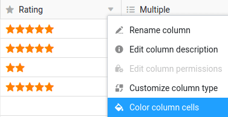
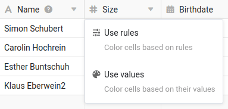
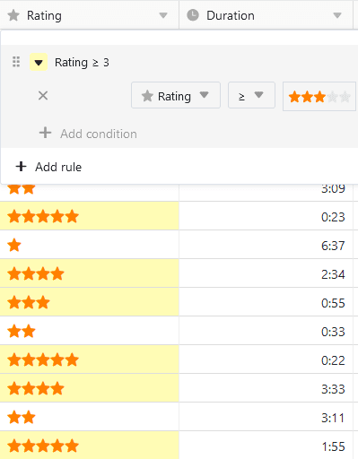

Ao contrário do Excel, não pode simplesmente colorir células no SeaTable como quiser, mas deve colori-las ou por **regras** definidas por si ou com base nos **valores** numa **coluna**. Parece complicado? Mas não é.



Para além da opção de **colorir células**, existe também a possibilidade de [marcação de linhas por cor]() . Neste caso, porém, as células não são coloridas, mas as marcas coloridas são colocadas no início das filas.



## Coloração por regras ou por valores

Cada coluna oferece a opção **Formatar células da coluna** an:  

O SeaTable comportar-se-á de forma diferente consoante o **tipo de coluna** para o qual chamar esta opção. Para [colunas numéricas](), pode utilizar tanto regras como valores para colorir. Para todos os outros tipos de colunas, apenas as regras de coloração estão disponíveis.

## Para colorir células por uma regra

1. Clique no **símbolo do triângulo** no cabeçalho da tabela de uma coluna.
2. Seleccionar a opção **Formatar células da coluna**.
3. Ir para **Regras de Utilização**.
4. Clique em **Add Rule (Adicionar regra)**.
5. Clique na nova linha que aparece para definir a regra.
6. Selecione uma **coluna** e escolha uma **condição** no campo central.
7. Introduzir o **valor** a que a condição está ligada.
8. Clique no **ícone do triângulo colorido** na frente da regra para abrir o selector de cores e mudar a cor das células às quais se aplica a sua regra.

Ao utilizar uma regra, colore **todas as células** de uma coluna à qual **se aplica** uma regra. Por exemplo, tal regra poderia ser: "Colorir todas as células com uma classificação de três ou mais estrelas amarelas".

É possível criar **várias regras com cores diferentes** por coluna.

Também pode definir **várias condições** por regra, que podem estar relacionadas com todas as colunas da tabela. Por exemplo, colorir a [coluna de texto]() com o título de um artigo se o **estado** não for "terminado", a **data de publicação** estiver no futuro e já existir uma **imagem** disponível.



## Para colorir células por valores

1. Clique no **símbolo do triângulo** no cabeçalho da tabela de uma coluna.
2. Seleccionar a opção **Formatar células da coluna**.
3. Ir para **Valores de Utilização**.
4. Clique na **selecção de cor** para escolher entre mais cores
5. Decidir de qual e até que **valor** deseja formatar as células.
6. Clique em **Submeter**.

Com a opção **Utilizar valores**, colore a coluna inteira. Quanto maior for um valor em todo o espectro, mais escura ou mais clara é a cor da célula.

Este tipo de coloração ajuda-o a tornar rápida e facilmente visíveis os valores **aberrantes** (isto é, particularmente pequenos ou particularmente grandes) numa coluna.

## Localizar duplicados

1. Clique no **símbolo do triângulo** no cabeçalho da tabela de uma coluna.
2. Seleccionar a opção **Formatar células da coluna**.
3. Ir para **Destacar Duplicações**.

Com a ajuda da opção de **Duplicatas em Destaque**, valores idênticos numa coluna podem ser encontrados rapidamente.

## Perguntas mais frequentes

### Preencher todas as células com a mesma cor

Para o fazer, definir uma regra que se aplique a todas as células desejadas. Por exemplo, é possível colorir todas as células **preenchidas** numa coluna, seleccionando a condição **não está vazia**.

### Cor nas próximas nomeações

Tem aqui duas opções para colorir as respectivas células de uma coluna de datas. Ou selecciona a condição **em ou depois** e uma **data exacta** - ou selecciona a opção **dentro de um** prazo e um período no futuro.

### Colorir uma data específica

Seleccionar a opção **é igual a** e introduzir a respectiva data.

