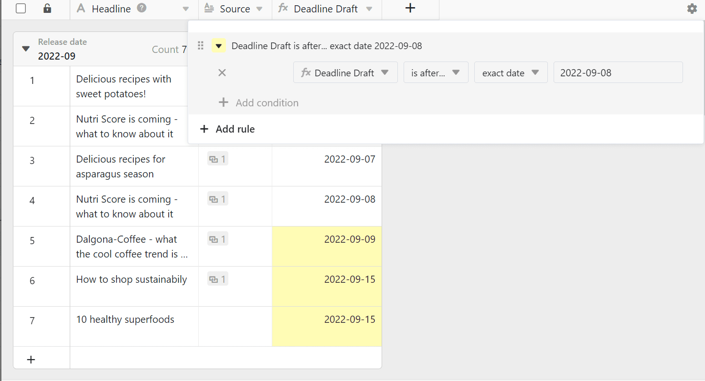

В отличие от Excel, в SeaTable вы не можете просто раскрасить ячейки по своему усмотрению, а должны раскрашивать их либо по установленным вами **правилам**, либо на основе **значений** в **столбце**. Звучит сложно? Но это не так.



В дополнение к опции **цветных ячеек** существует также возможность цветовой маркировки [строк](). В этом случае, однако, ячейки не окрашиваются, но в начале строк устанавливаются цветные метки.



## Окрашивание по правилам или по ценностям

Каждая колонка предлагает возможность **Форматирование ячеек столбца** an:  

SeaTable будет вести себя по-разному в зависимости от **типа столбца**, для которого вы вызываете эту опцию. Для [числовых столбцов]() можно использовать как правила, так и значения для раскраски. Для всех остальных типов столбцов доступны только правила раскраски.

## Чтобы раскрасить ячейки по правилу

1. Нажмите на **символ треугольника** в заголовке таблицы в столбце.
2. Выберите опцию **Форматировать ячейки столбца**.
3. Перейдите к разделу " **Правила использования**".
4. Нажмите кнопку **Добавить правило**.
5. Щелкните на появившейся строке, чтобы задать правило.
6. Выберите **столбец** и определите **условие** в центральном поле.
7. Введите **значение**, к которому привязано условие.
8. Нажмите на **значок цветного треугольника** перед правилом, чтобы открыть инструмент выбора цвета и изменить цвет ячеек, к которым применяется правило.

Используя правило, вы окрашиваете **все ячейки** в столбце, к которым **применяется** правило. Например, такое правило может звучать так: "Окрасить все ячейки с оценкой в три и более звезд в желтый цвет".

Вы можете создать **несколько правил с разными цветами** для каждого столбца.

Вы также можете задать **несколько условий** для каждого правила, которые могут относиться ко всем столбцам таблицы. Например, окрашивать [текстовый столбец]() заголовком статьи, если ее **статус** не "завершена", **дата публикации** находится в будущем и **изображение** уже доступно.



## Чтобы раскрасить ячейки по значениям

1. Нажмите на **символ треугольника** в заголовке таблицы в столбце.
2. Выберите опцию **Форматировать ячейки столбца**.
3. Перейдите к разделу **Использовать значения**.
4. Нажмите на **выбор цвета**, чтобы выбрать другие цвета
5. Определите, от какого **значения** и до какого **значения** вы хотите отформатировать ячейки.
6. Нажмите **Отправить**.

С опцией **Использовать значения** вы окрашиваете весь столбец. Чем больше значение во всем спектре, тем темнее или светлее цвет ячейки.

Этот тип окрашивания помогает быстро и легко сделать видимыми в столбце **выбросы** (т.е. особенно маленькие или особенно большие значения).

## Найдите дубликаты

1. Нажмите на **символ треугольника** в заголовке таблицы в столбце.
2. Выберите опцию **Форматировать ячейки столбца**.
3. Перейдите к **Выделить дубликаты**.

С помощью опции **"Выделить дубликаты"** можно быстро найти одинаковые значения в столбце.

## Часто задаваемые вопросы

### Заполните все ячейки одним цветом

Для этого определите правило, которое применяется ко всем нужным ячейкам. Например, вы можете окрасить все **заполненные** ячейки в столбце, выбрав условие **не пустой**.

### Цвет в предстоящих встречах

У вас есть два варианта, чтобы окрасить соответствующие ячейки столбца дат. Либо вы выбираете условие - **on или after** и **точную дату** - либо вы выбираете опцию - **within** и период в будущем.

### Выделить цветом определенную дату

Выберите опцию **равно** и введите соответствующую дату.

