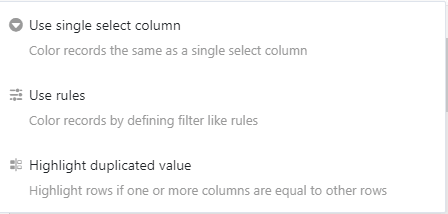
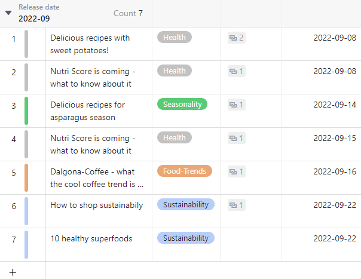

Mithilfe des **Zeilen-formatieren-Werkzeugs** können Sie farbliche Markierungen am **Zeilenanfang** setzen. Das **farbliche Markieren von Zeilen** dient dabei der schnellen Identifikation bestimmter Datensätze. Dies ist nicht zu verwechseln mit dem [Einfärben von Zellen](), wodurch Sie einzelne Zellen farblich hervorheben können.

## Das Zeilen-formatieren-Werkzeug

In den Ansichtsoptionen über einer Tabelle finden Sie folgendes Symbol:

Nach einem Klick auf das Zeilen-formatieren-Werkzeug können Sie zwischen **drei Optionen** für die farbliche Markierung wählen:

- Einfachauswahl-Spalte verwenden
- Regeln verwenden
- Duplikate hervorheben

## Einfachauswahl-Spalte verwenden

Für die Option **Einfachauswahl-Spalte verwenden** benötigen Sie in Ihrer Tabelle eine Spalte dieses Typs. So können Sie jede Zeile am **Zeilenanfang** mit der Farbe der jeweiligen Option markieren, die in dieser Spalte eingetragen ist.



Erfahren Sie [hier](), wie Sie neue Einfachauswahlspalten anlegen.



## Regeln verwenden

Die Option **Regeln verwenden** erlaubt es Ihnen, Bedingungen für die farbliche Markierung festzulegen.

- Klicken Sie auf das **farbig hinterlegte Dreieck-Symbol**, um die Farbe der Markierung zu ändern.
  
- Legen Sie fest, auf welche Ihrer **Spalten** sich die Bedingung beziehen soll.
  
- Entscheiden Sie sich für die **Art der Bedingung**.
  



### Beispiel für Regel verwenden

In diesem Beispiel sollen alle Zeilen in einem Redaktionsplan markiert werden, die in der [Checkbox-Spalte]() als erledigt markiert sind. Hierfür wurde die **Spalte "Published"** ausgewählt, die Bedingung **"ist"** verwendet und festgelegt, dass die **mit einem Haken versehenen** Zeilen markiert werden sollen.

### Beispiel für eine Regel mit mehreren Bedingungen

In diesem Beispiel möchten wir nur Zeilen des Redaktionsplans farblich hervorheben, wenn der **Status** des Posts nicht "fertig" ist, das **Veröffentlichungsdatum** in der Zukunft liegt und bereits ein **Bild** vorhanden ist.

## Duplikate hervorheben

Zeilen mit einem oder mehreren identischen Spaltenwerten können Sie mit der Option **Duplikate hervorheben** farblich markieren. Wählen Sie hierzu die Spalte aus, die Sie auf Duplikate prüfen möchten. So können Sie Duplikate in Ihrer Tabelle leicht identifizieren und ggf. korrigieren oder löschen.

