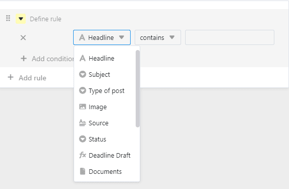
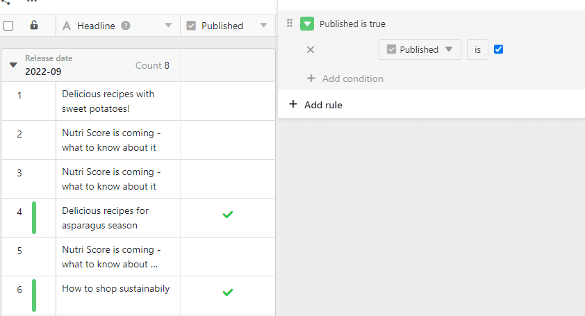
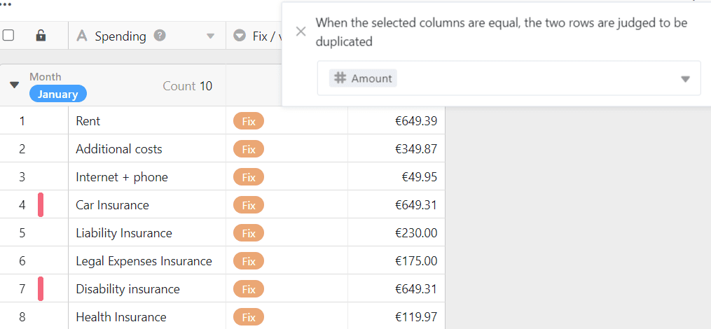

With the help of the **rows-format tool** you can set colored markings at the beginning of rows. The **color marking of rows** serves the quick identification of certain data sets. This is not to be confused with [coloring cells](), which allows you to highlight individual cells.

## The rows-format tool

In the view options above a table you will find the following icon:

After clicking on the rows-format tool, you can choose between **three options** for color highlighting:

- Use single selection column
- Use rules
- Highlight duplicates

## Use single select column

For the **Use single selection column** option, you need a column of this type in your table. This allows you to mark each row at the beginning with the color of the respective option that is entered in this column.



Find out [here]() how to create new single selection columns.



## Use rules

The **Use rules** option allows you to set conditions for color highlighting.

- Click on the **colored triangle symbol**to change the color of the marker.
  
- Specify to which of your **Columns** the condition should refer to.
  
- Decide for the **Condition type**.
  



### Use rule example

In this example, all rows in an editorial plan that are marked as completed in the [checkbox column]() are to be marked. To do this, the **"Published" column** was selected, the condition **"is"** was used and it was specified that the rows **with a checkmark** should be marked.

### Example of a rule with multiple conditions

In this example, we only want to highlight rows the editorial plan in color if the **status** of the post is not "finished", the **publication date** is in the future and an **image** already exists.

## Highlight duplicates

rows with one or more identical column values can be highlighted using the **Highlight Duplicates** option. To do this, select the column you want to check for duplicates. This way you can easily identify duplicates in your table and correct or delete them if necessary.

