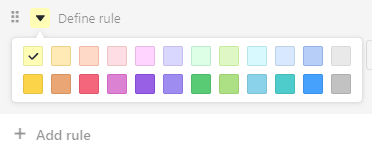
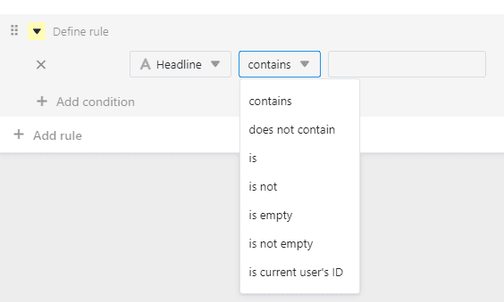

Puede utilizar la **herramienta de formato de línea para** establecer marcas de color al **principio de las líneas**. El **marcado** por colores **de las filas** sirve para identificar rápidamente determinados registros de datos. Esto no debe confundirse con [colorear celdas](), que permite resaltar celdas individuales.

## La herramienta de formato de línea

En las opciones de vista sobre una tabla encontrará el siguiente símbolo:

Tras hacer clic en la herramienta de formato de línea, puede elegir entre **tres opciones** para la marca de color:

- Utilizar una sola columna de selección
- Normas de uso
- Resaltar los duplicados

## Utilizar una sola columna de selección

Para la opción **Utilizar columna de selección única**, necesita una columna de este tipo en su tabla. Esto le permite marcar cada fila al **principio de la línea** con el color de la opción respectiva que se introduce en esta columna.



## Normas de uso

La opción **Utilizar reglas** permite establecer las condiciones para el marcado en color.

- Haga clic en el botón **símbolo del triángulo de color**para cambiar el color del marcador.
  
- Determine cuál de sus **Columnas** la condición debe referirse.
  
- Decidir a favor del **Tipo de condición**.
  



### Ejemplo de regla de uso

En este ejemplo, se desea resaltar todas las filas de un plan editorial que estén marcadas como completadas en la [columna de casillas de verificación](https://seatable.io/es/docs/auswahlspalten/anlegen-einer-checkbox-spalte/) . Para ello, se ha seleccionado la columna **"Publicado"**, se ha utilizado la condición **"es"** y se ha especificado que se marquen las filas **con una marca de verificación**.

### Ejemplo de regla con varias condiciones

En este ejemplo, sólo queremos resaltar en color las líneas del plan editorial si el **estado** del post no es "terminado", la **fecha de publicación** es futura y ya hay una **imagen** disponible.

## Resaltar los duplicados

Puede resaltar filas con uno o más valores de columna idénticos utilizando la opción **Resaltar duplicados**. Para ello, seleccione la columna en la que desea comprobar si hay duplicados. Así podrá identificar fácilmente los duplicados en su tabla y corregirlos o eliminarlos si es necesario.

